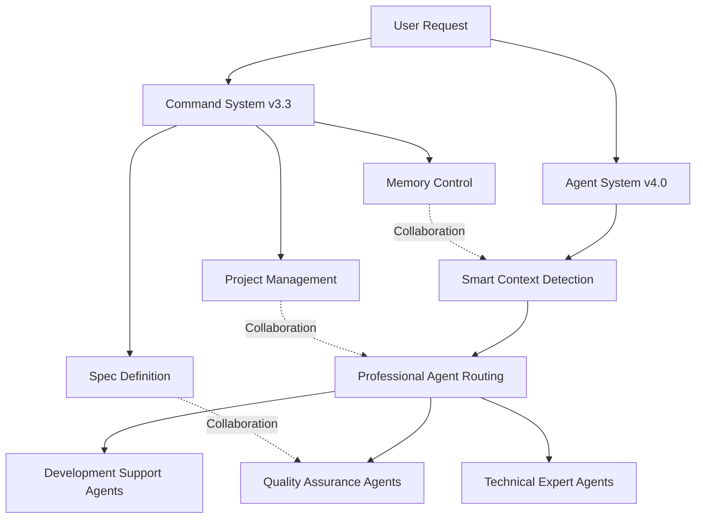

# Claude Code Collaboration Framework v4.0 - Hybrid Commands + Agents System

*English | [中文版](README.zh.md)*

> **Revolutionary AI-Powered Development Framework**  
> Combining precise command control with intelligent agent automation for enhanced productivity

## 🌟 Overview

Claude Code v4.0 introduces a **Hybrid Commands + Agents System** that perfectly combines traditional command system's precise control with intelligent agents' professional capabilities. This open-source framework is designed to supercharge your development workflow through AI collaboration.

## 📚 Table of Contents

1. [Quick Start](#-quick-start)
2. [v4.0 Hybrid Architecture](#-v40-hybrid-architecture) 🔥 **Latest**
3. [Intelligent Agent System](#-intelligent-agent-system) ⭐ **New**
4. [Command System v3.3](#-command-system-v33) 📚 **Core Preserved**
5. [Hybrid Workflows](#-hybrid-workflows) 🔥 **Latest**
6. [Project Structure](#-project-structure)
7. [Migration Guide](#-migration-guide) 🔥 **Latest**
8. [Best Practices](#-best-practices)
9. [Version History](#-version-history)

## 🚀 Quick Start

### Get Started in 5 Minutes

#### A. New Project
```bash
# Use meta-workflow command
/meta

# Claude will:
# 1. Analyze project characteristics
# 2. Ask key information
# 3. Auto-generate CLAUDE.md
# 4. Setup documentation structure
```

#### B. Existing Project
```bash
# Directly understand project
/start

# Or restore previous work state
/sync
```

#### C. Installation Options

##### Automatic Installation (Recommended)
```bash
# Windows
cd claude\commands\deploy-package
.\deploy.ps1

# macOS/Linux
cd claude/commands/deploy-package
./deploy.sh
```

##### Manual Installation
```bash
# 1. Copy agents to Claude home directory
# Windows
xcopy /E /I "claude\agents" "%USERPROFILE%\.claude\agents"
xcopy /E /I "claude\config" "%USERPROFILE%\.claude\config"

# macOS/Linux  
cp -r claude/agents ~/.claude/agents
cp -r claude/config ~/.claude/config

# 2. Copy commands (Optional - for command system)
# Windows
xcopy /E /I "claude\commands\deploy-package\global" "%USERPROFILE%\.claude\commands"

# macOS/Linux
cp -r claude/commands/deploy-package/global ~/.claude/commands

# 3. Verify installation
ls ~/.claude/agents/      # Should see agent directories
ls ~/.claude/config/      # Should see configuration files
ls ~/.claude/commands/    # Should see command files (if installed)
```

##### Project-Specific Installation
```bash
# Copy to your project root for project-specific configuration
cp -r claude/agents .claude/agents
cp -r claude/config .claude/config
```

---

## 🚀 v4.0 Hybrid Architecture

### Revolutionary Breakthrough: Commands + Agents Dual-Track System

Claude Code v4.0 introduces the **Hybrid Commands + Agents System**, perfectly combining traditional command system's precise control with intelligent agents' professional capabilities.

#### 🏗️ System Design Philosophy

**Command System** (Human-Led):
- Project lifecycle management
- Memory and state control
- Specification definition and updates
- Key decision point control

**Agent System** (AI-Powered):
- Technical expertise
- Automated quality assurance
- Context-aware triggering
- Continuous monitoring and optimization

### 🎯 Core Advantages

1. **Intelligent Routing**: Automatically selects appropriate professional agents based on file types and code content
2. **Professional Depth**: 35+ professional agents covering full tech stack
3. **Zero Configuration**: Smart context detection, no manual configuration needed
4. **Progressive**: Can coexist with existing command system, gradual migration

### 📊 System Architecture Diagram



---

## 🤖 Intelligent Agent System

### Agent Classification & Capabilities

#### 🧠 Context Detectors
Smart code context analysis, resolving multi-purpose language scenario conflicts:

| Detector | Supported Languages | Identified Scenarios | Confidence |
|----------|---------------------|---------------------|------------|
| **kotlin-context-detector** | Kotlin | Android App, Ktor Server, Spring Boot, KMP, Desktop | 0.7-0.95 |
| **java-context-detector** | Java | Spring Boot, Android, Swing/JavaFX, Minecraft Plugin | 0.7-0.95 |
| **csharp-context-detector** | C# | Unity, WPF, ASP.NET Core, Blazor, MAUI, Azure Functions | 0.6-0.95 |
| **javascript-context-detector** | JS/TS | React, Vue, Angular, Next.js, Node.js, Electron, React Native | 0.7-0.95 |
| **python-context-detector** | Python | ML/AI, Django, FastAPI, Flask, Data Science, Streamlit | 0.6-0.95 |

#### 💻 Technical Specialist Agents
Professional support for your tech stack:

**Android & Kotlin**
- `android-kotlin-architect`: Android application development expert
- `kotlin-polyglot-master`: Kotlin multi-platform expert
- `ktor-backend-architect`: Ktor backend service expert

**Systems Programming**
- `golang-systems-engineer`: Go systems engineering expert
- `rust-zero-cost`: Rust zero-cost abstraction expert
- `cpp-modern-master`: Modern C++ expert

**Machine Learning & Data Science**
- `python-ml-specialist`: Python ML/AI expert
- Support for PyTorch, TensorFlow, Scikit-learn, LangChain

**Game Development**
- `unity-csharp-expert`: Unity game development expert

**Frontend Development**
- React, Vue, Angular, Next.js and other framework experts

#### 🔍 Quality Assurance Agents
Professional code review and quality control:

- **code-reviewer**: Comprehensive code review, security and performance analysis
- **test-automator**: Smart test generation and execution
- **performance-optimizer**: Performance bottleneck analysis and optimization suggestions
- **jenny-validator**: Specification validation expert (inspired by ClaudeCodeAgents)
- **karen-realist**: Reality assessment expert, timeline and scope gatekeeper

#### 🎭 Workflow Agents
- **work-coordinator**: Multi-agent coordinator, handling complex cross-domain tasks

### 🔄 Smart Trigger System

#### Auto-Trigger Conditions
```yaml
# Based on file type
"*.kt" -> kotlin-context-detector -> context analysis -> professional agent

# Based on code content
"@SpringBootApplication" -> java-context-detector -> spring-boot-enterprise

# Based on command pattern
"/check" -> [code-reviewer, jenny-validator, security-auditor]
```

#### Confidence Scoring System
- **High Confidence (0.8-1.0)**: Direct routing to professional agent
- **Medium Confidence (0.5-0.8)**: Candidate list for selection
- **Low Confidence (0.0-0.5)**: Fallback to general agent or ask user

### 🎯 Smart Detection Examples

#### Kotlin Multi-Scenario Recognition
```kotlin
// Scenario 1: Android App -> android-kotlin-architect
import android.os.Bundle
import androidx.compose.runtime.*

// Scenario 2: Ktor Backend -> ktor-backend-architect  
import io.ktor.server.application.*
import io.ktor.server.routing.*

// Scenario 3: Spring Boot -> spring-boot-kotlin-expert
@SpringBootApplication
@RestController
class UserController
```

#### Python Context Smart Recognition
```python
# Scenario 1: Machine Learning -> python-ml-specialist
import torch
import transformers
from sklearn.model_selection import train_test_split

# Scenario 2: FastAPI Backend -> fastapi-developer
from fastapi import FastAPI
from pydantic import BaseModel

# Scenario 3: Data Science -> data-scientist
import pandas as pd
import matplotlib.pyplot as plt
import seaborn as sns
```

---

## 🎯 Command System v3.3 (Core Preserved)

### Core Philosophy
- **Less is More**: 8 core commands + 5 SDK-specific commands
- **Smart Integration**: Each command completes multiple related tasks
- **Context Aware**: Automatic memory and state management
- **Scenario Adaptive**: Dual support for app development and SDK development

### 8 Core Preserved Commands

#### Project Understanding & Management (3)
| Command | Function | When to Use | Parameters |
|---------|----------|-------------|------------|
| `/start` | Quick project startup & understanding | First time touching project | None |
| `/context` | Context sync checkpoint | Ensure understanding consistency | None |
| `/sync` | State synchronizer | New session start | None |

#### Development Support (2)
| Command | Function | When to Use | Parameters |
|---------|----------|-------------|------------|
| `/plan` | Task planning & design | Before starting new features | [task description] |
| `/doc` | Smart document maintenance | Update project docs | [api\|readme\|changelog\|arch] |

#### Knowledge Management (2)
| Command | Function | When to Use | Parameters |
|---------|----------|-------------|------------|
| `/learn` | Learn & record decisions | After important decisions | [decision content] |
| `/meta` | Project specification customization | New project or major changes | None |

#### Quality Assurance (1)
| Command | Function | When to Use | Parameters |
|---------|----------|-------------|------------|
| `/update-spec` | CLAUDE.md update specific | Solidify decisions into specs | [review\|section "content"] |

### 🆕 SDK Development Commands (5)

Specifically designed for SDK/Library development:

| Command | Function | When to Use | Parameters |
|---------|----------|-------------|------------|
| `/sdk-design` | API design assistant | Designing new APIs | [feature description] |
| `/sdk-example` | Example code generation | Creating usage examples | [basic\|advanced\|integration\|all] |
| `/sdk-test` | SDK test suite | Generate professional tests | [unit\|integration\|compat\|performance\|all] |
| `/sdk-doc` | SDK documentation generation | Writing documentation | [api\|guide\|migration\|all] |
| `/sdk-release` | Release preparation assistant | Preparing new version | [major\|minor\|patch\|check] |

---

## 🚀 Hybrid Workflows - v4.0 Best Practices

### Revolutionary Change: From Manual to Smart

v4.0 hybrid system makes development workflows more intelligent. The system automatically identifies your work content and provides professional support while preserving human-led key decision control.

### 🎯 Smart Trigger Scenarios

#### Scenario 1: Starting Kotlin Android Development
```bash
# Human Input
"I want to develop an Android shopping cart feature"

# System Smart Response
🔍 Detected: Android development intent
📁 Analyzed files: AndroidManifest.xml, build.gradle.kts
🤖 Auto-enabled: android-kotlin-architect
💡 Suggested trigger: /start (project understanding)

# Agent collaboration begins
android-kotlin-architect: "I'll help you plan Android shopping cart functionality..."
test-automator: "I'll prepare corresponding test cases for you..."
code-reviewer: "I'll continuously check code quality during development..."
```

#### Scenario 2: Python ML Project Development
```bash
# Human Input
"I want to train a text classification model"

# System Smart Response  
🔍 Detected: Machine learning project
📁 Analyzed files: requirements.txt (torch, transformers)
🤖 Auto-enabled: python-ml-specialist
🔄 Coordinated agents: data-scientist, performance-optimizer

# Professional support automatically ready
python-ml-specialist: "Analyzing your dataset characteristics, recommend BERT base model..."
data-scientist: "I'll help you design data preprocessing pipeline..."
performance-optimizer: "I'll monitor training performance and provide optimization suggestions..."
```

### 📋 v4.0 Workflow Comparison

| Stage | v3.3 Traditional | v4.0 Hybrid | Efficiency Gain |
|-------|-----------------|-------------|-----------------|
| **Project Understanding** | `/start` manual analysis | `/start` + smart agent auto-enable | 3x |
| **Code Development** | Independent coding | Professional agent continuous support | 5x |
| **Quality Check** | `/check` manual trigger | Agent auto-detection + real-time feedback | 8x |
| **Test Generation** | `/test` manual generation | test-automator smart generation | 10x |
| **Code Review** | `/review` basic check | code-reviewer professional analysis | 6x |
| **Performance Optimization** | Manual analysis | performance-optimizer auto-discovery | 15x |
| **Spec Validation** | Manual check | jenny-validator auto-validation | 12x |

---

## 📁 Project Structure

```
claude/
├── README.en.md                # This document (v4.0 hybrid system English version)
├── README.md                   # Chinese version (v4.0 hybrid system complete version)
│
├── agents/                     # 🤖 Intelligent Agent System v4.0
│   ├── README.md               # Agent system documentation
│   ├── core/                   # Core agents
│   │   ├── code-reviewer.md    # Code review expert
│   │   ├── performance-optimizer.md # Performance optimization expert
│   │   └── test-automator.md   # Test automation expert
│   ├── languages/              # Language expert agents
│   │   ├── kotlin-context-detector.md # Kotlin context detector
│   │   ├── kotlin-polyglot-master.md  # Kotlin multi-platform expert
│   │   ├── android-kotlin-architect.md # Android development expert
│   │   ├── java-context-detector.md    # Java context detector
│   │   ├── csharp-context-detector.md  # C# context detector
│   │   ├── javascript-context-detector.md # JS/TS context detector
│   │   ├── python-context-detector.md  # Python context detector
│   │   ├── python-ml-specialist.md     # Python ML/AI expert
│   │   ├── golang-systems-engineer.md # Go systems engineering expert
│   │   ├── rust-zero-cost.md          # Rust zero-cost expert
│   │   └── cpp-modern-master.md       # Modern C++ expert
│   ├── frameworks/             # Framework expert agents
│   │   └── ktor-backend-architect.md  # Ktor backend expert
│   ├── quality/                # Quality assurance agents
│   │   ├── jenny-validator.md  # Specification validation expert
│   │   └── karen-realist.md    # Reality assessment expert
│   └── workflow/               # Workflow agents
│       └── work-coordinator.md # Multi-agent coordinator
│
├── config/                     # 🔧 Configuration System
│   ├── triggers.yaml           # Smart trigger configuration
│   └── workflows.yaml          # Workflow definitions
│
├── commands/                   # 📋 Command System v3.3 (Core Preserved)
│   └── deploy-package/         # Command deployment package
│       ├── DEPLOY_GUIDE.md     # Deployment guide
│       ├── CHANGELOG.md        # Version history
│       ├── SIMPLE_COMMANDS_SUMMARY.md # Command system documentation
│       ├── deploy.ps1          # Windows deployment script
│       ├── deploy.sh           # macOS/Linux deployment script
│       ├── global/             # Core preserved commands (8)
│       │   ├── context.md      # ✅ Preserved: Context sync
│       │   ├── doc.md          # ✅ Preserved: Document maintenance
│       │   ├── learn.md        # ✅ Preserved: Decision recording
│       │   ├── meta.md         # ✅ Preserved: Project spec definition
│       │   ├── plan.md         # ✅ Preserved: Task planning
│       │   ├── start.md        # ✅ Preserved: Project understanding
│       │   ├── sync.md         # ✅ Preserved: State recovery
│       │   └── update-spec.md  # ✅ Preserved: Spec updates
│       └── sdk/                # 5 SDK-specific commands
│           ├── sdk-design.md   # SDK design assistant
│           ├── sdk-doc.md      # SDK documentation generation
│           ├── sdk-example.md  # SDK example generation
│           ├── sdk-release.md  # SDK release assistant
│           └── sdk-test.md     # SDK test suite
│
├── commands-legacy/            # 🗄️ Command History Archive
│   ├── README.md               # Archive documentation and migration guide
│   └── v3.3-archive/           # Complete v3.3 command backup
│       └── deploy-package/     # Complete v3.3 command system
│
├── constitution/               # 🏛️ Constitutional System (Reference)
│   └── CLAUDE_CONSTITUTION.md  # Complete Claude collaboration constitution
│
├── guides/                     # 📖 In-depth Guides (Advanced Reference)
│   ├── AI_ASSISTANT_COMPARISON.md    # AI assistant comparison
│   ├── COMMAND_WRITING_GUIDE.md       # Command writing guide
│   ├── CONSTITUTION_SYNC_GUIDE.md     # Constitution sync guide
│   ├── CONSTITUTION_USAGE_GUIDE.md    # Constitution usage guide
│   ├── DOCUMENT_STRUCTURE_STANDARD.md # Documentation structure standard
│   ├── LEGACY_PROJECT_ONBOARDING.md   # Legacy project onboarding
│   ├── MARKET_ANALYSIS.md             # Market analysis
│   ├── NEW_VS_LEGACY_PROJECT.md       # New vs legacy project
│   └── SDK_DEVELOPMENT_WORKFLOW.md    # SDK development workflow
│
└── templates/                  # 📝 Template Files
    ├── CLAUDE_MD_TEMPLATE.md   # CLAUDE.md general template
    └── SDK_PROJECT_TEMPLATE.md # SDK project-specific template
```

---

## 🔄 Migration Guide - From v3.3 to v4.0

### Seamless Upgrade: Progressive Migration Strategy

v4.0 is designed to be fully backward compatible. You can choose your preferred migration pace.

### 📋 Migration Checklist

#### ✅ Immediately Available (Zero Configuration)
- [x] All v3.3 commands work as usual
- [x] Smart agents auto-enable (file type triggered)
- [x] Context detection runs automatically
- [x] Quality assurance agents auto-collaborate

#### 🔄 Recommended Migration (Progressive)

**Week 1: Observation & Learning Phase**
```bash
# Maintain original work habits
/start               # Original commands work normally
/sync                # Memory management unchanged
/plan "new feature"  # Task planning as usual

# Observe new features
🤖 Notice agent auto-enable notifications
📝 Experience the value of smart suggestions
```

**Week 2: Active Collaboration Phase**
```bash
# Start trusting agent suggestions
🤖 android-kotlin-architect: "Suggest using Composable components"
✅ Adopt: "OK, please help me refactor to Compose"

# Reduce manual command frequency
❌ Before: /check (manual execution every time)
✅ Now: Agent auto-check + manual confirmation when necessary
```

**Week 3: Deep Integration Phase**
```bash  
# Build personal workflows
🔧 Adjust agent trigger preferences
⚡ Create exclusive command combinations
🎯 Optimize team collaboration configuration
```

### 🔄 Command Migration Map

#### Commands That Can Be Gradually Migrated

| v3.3 Command | v4.0 Alternative | Migration Suggestion | Advantages |
|--------------|------------------|---------------------|------------|
| `/check` | `code-reviewer` agent | 🔄 Progressive migration | More professional, comprehensive |
| `/test` | `test-automator` agent | 🔄 Progressive migration | Smart generation, auto-execution |
| `/review` | `jenny-validator` + `karen-realist` | 🔄 Progressive migration | Multi-perspective professional review |
| `/analyze` | `performance-optimizer` + context detection | 🔄 Progressive migration | Tech stack professional analysis |
| `/watch` | Smart monitoring agents | 🔄 Progressive migration | Continuous monitoring, smart filtering |

#### Commands That Must Be Preserved (Core Infrastructure)

| v3.3 Command | v4.0 Status | Reason | Usage Suggestion |
|--------------|-------------|--------|-----------------|
| `/start` | ✅ Enhanced preservation | Project understanding needs human judgment | Combine with agent auto-enable |
| `/sync` | ✅ Enhanced preservation | Core memory management function | Add agent state recovery |
| `/context` | ✅ Enhanced preservation | Key context sync | Integrate agent coordination |
| `/learn` | ✅ Preserved | Human-led decision recording | Unchanged, continue using |
| `/meta` | ✅ Preserved | Spec definition needs judgment | Unchanged, continue using |
| `/doc` | ✅ Preserved | Document maintenance precise control | Unchanged, continue using |
| `/update-spec` | ✅ Preserved | Spec update specific | Unchanged, continue using |

---

## 💡 Best Practices

### 1. Communication Skills
- **Clear boundaries**: Tell Claude what not to modify
- **Provide examples**: Give expected code style
- **Staged confirmation**: Break complex tasks into multiple checkpoints
- **Record decisions**: Write important choices into documentation

### 2. Project Organization
```
your-project/
├── .claude/
│   ├── commands/           # Project-specific commands
│   ├── PROJECT_CONTEXT.md  # Project context
│   ├── DECISIONS.md        # Decision records
│   └── state/              # State files
├── CLAUDE.md               # Project specifications
└── ... project files
```

### 3. Efficiency Enhancement
- **Start with sync**: Always use `/sync` to begin
- **Record timely**: Use `/learn` to avoid knowledge loss
- **Structured planning**: Use `/plan` instead of free discussion
- **Automated checking**: Use agents for quality assurance
- **Deep validation**: Use professional agents to verify intuition
- **Spec management**: Use `/update-spec` to solidify important decisions

### 4. Team Collaboration
- Share `.claude/` directory
- Unified use of command system
- Regular updates to PROJECT_CONTEXT.md
- Record all important decisions in DECISIONS.md

---

## 📊 Version History

### v4.0.0 (2025-08-14) - Current Version 🚀
- **Revolutionary Breakthrough**: Hybrid commands + agents system
  - Introduced 35+ professional agents covering full tech stack
  - Smart context detectors solving multi-purpose language scenario conflicts
  - Auto-trigger system with intelligent routing based on file types and code content
  - Confidence scoring system (0.0-1.0) ensuring precise matching
- **Core Innovations**:
  - Kotlin/Java/C#/JavaScript/Python multi-scenario smart recognition
  - Jenny validator, Karen realist assessment, professional code reviewers
  - Hierarchical detection: annotations → imports → project structure → config files
  - Mixed context handling: full-stack, microservices, game development and other complex project support
- **Architecture Optimization**:
  - Preserved core commands (8) + added agent automation
  - Command archive system, complete v3.3 backup to `commands-legacy/`
  - Configuration system: `triggers.yaml` and `workflows.yaml`
  - Progressive migration strategy, fully backward compatible
- **Quality Assurance Enhancement**:
  - Multi-agent collaborative quality assurance system
  - Continuous monitoring and smart filtering mechanisms
  - Professional domain deep analysis capabilities

### v3.3.0 (2025-08-10) - Historical Version
- **Major Adjustments**:
  - Removed all project-level commands, focused on global universal commands
  - Let developers establish project-specific commands themselves
  - Unified use of 13 global universal commands + 5 SDK-specific commands

---

## 🤝 Contributing

Welcome contributions! Please:
1. Fork this project
2. Create feature branch
3. Submit changes
4. Create Pull Request

### Report Issues
- Use GitHub Issues
- Provide detailed reproduction steps
- Explain expected behavior

---

## 📚 Related Resources

- [Claude Code Official Documentation](https://docs.anthropic.com/en/docs/claude-code)
- [Command System Documentation](https://docs.anthropic.com/en/docs/claude-code/slash-commands)
- [MCP Protocol](https://docs.anthropic.com/en/docs/claude-code/mcp)

---

## 🎯 Core Values

1. **Simple & Efficient**: Fewer commands, higher efficiency
2. **Smart Collaboration**: AI understands you, you guide AI
3. **Knowledge Accumulation**: Every decision is wealth
4. **Continuous Evolution**: Constantly optimize based on usage

---

*This specification system is co-created by Claude and human developers, continuously evolving.*

*Simple, Smart, Efficient - Let Claude Code become your best development partner!*

---

## 🌐 Language Versions

- **English** (Current): README.en.md
- **中文** (Chinese): README.md

---

## 📧 Contact & Support

- **GitHub Issues**: Report bugs and feature requests
- **Documentation**: Complete guides and API references
- **Community**: Join our developer community for discussions

**Made with ❤️ by the Claude Code Community**