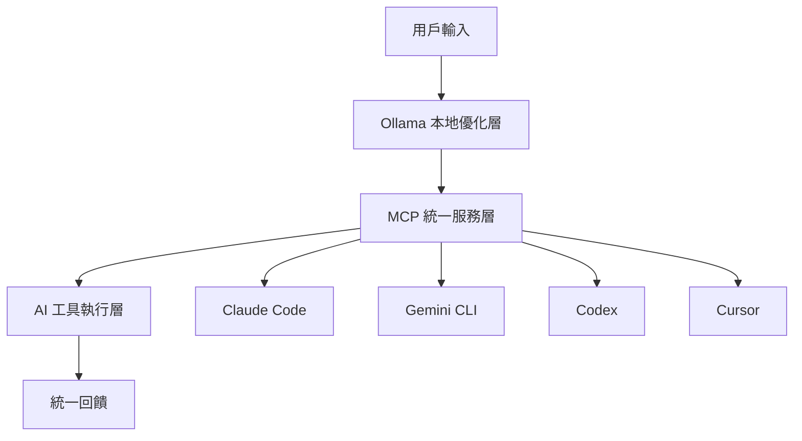

# 🤖 Universal AI Coding Framework

*基於 MCP + Ollama 的新一代 AI 編程協作解決方案*

[](LICENSE)
[](https://modelcontextprotocol.io/)
[](https://ollama.ai/)

## 🎯 解決什麼問題？

### 當前 AI Coding 工具的痛點
- **🔄 多工具割裂** - Claude Code、Gemini CLI、Cursor 等工具無法共享工作狀態
- **💸 Token 浪費** - 模糊提問導致 AI 發散，反覆修改消耗大量 token
- **🌪️ 缺乏紀律** - 無標準化流程，容易陷入無限循環修復
- **🔒 隱私風險** - 敏感項目信息可能外洩到雲端服務

### 我們的解決方案
**規格驅動 + MCP + Ollama 三層架構** = 規範產出 + 統一協作 + 本地優化 + 隱私保護

```
規格層(Spec) → MCP統一層 → Ollama優化層 → AI工具執行層
```

> 💡 **設計靈感**：部分借鑒了 [GitHub Spec-Kit](https://github.com/github/spec-kit) 的規格驅動開發(SDD)理念，將可執行規格作為高質量輸入，提供給我們的 MCP + ADDP 工作流程。

## ✨ 核心特性

### 🧠 智能查詢優化
```
"優化性能" → "使用 React.memo 和 useMemo 優化組件渲染性能，目標減少 50% 不必要的重渲染"
```
- 本地 Ollama 預處理用戶輸入
- 40-60% 精準度提升
- 30-50% token 節省
- 100% 隱私保護

### 🔄 跨工具同步
- **統一記憶系統** - 所有 AI 工具共享項目上下文
- **MCP 標準協議** - 確保跨工具兼容性
- **無縫切換** - 在 Claude Code 開始的項目可直接切換到 Gemini CLI 繼續

### 🏗️ 規格驅動的標準化工作流程
**SDD + ADDP 融合框架** - 規格驅動的紀律性編程工作流

#### 📋 Specification (規格產出階段)
```
/specify "優化性能" → 產生完整的功能規格文檔(PRD)
/plan → 生成技術方案和實施計劃
/tasks → 分解為可執行的開發任務
```
- **PRD 生成** - 將模糊需求轉化為明確的產品規格
- **技術方案** - 基於約束條件生成最優技術方案
- **任務分解** - 分解為可測試、可驗證的小任務
- **門禁檢查** - TDD 先行、反抽象、簡化優先等硬約束

#### 🔍 Analysis (需求分析階段)
```
規格輸入: "完整PRD + 技術方案"
↓ ADDP 分析
精準執行計劃: "具體實施步驟 + 驗收標準 + 回滾策略"
```
- **規格解析** - 從 PRD 提取技術需求
- **上下文增強** - 載入項目歷史決策和約束
- **影響分析** - 評估變更對現有系統的影響
- **風險評估** - 識別技術風險和依賴關係

#### 📐 Design (架構設計階段)
- **架構分析** - 分析當前系統結構和修改點
- **方案生成** - 基於約束條件生成多個解決方案
- **權衡分析** - 性能 vs 複雜度 vs 維護成本對比
- **實施規劃** - 生成可執行的分步實施計劃

#### ⚡ Development (TDD 驅動開發)
- **測試先行** - 強制執行 TDD，先寫測試再寫代碼
- **最小化修改** - 每次僅修改 ≤3 個檔案，減少破壞風險
- **增量驗證** - 每步修改都要通過測試和 lint 檢查
- **即時回饋** - 實時性能監控和代碼質量檢查

#### ✅ Persistence (驗證與持久化)
- **完整測試** - 運行全套測試確保無回歸
- **性能驗證** - 確認性能改善達到預期目標
- **記憶更新** - 保存決策過程和經驗到項目記憶
- **跨工具同步** - 狀態同步到所有 AI 工具

## 🏗️ 技術架構



### 第一層：Ollama 本地優化器
- **模型推薦**：Qwen2.5:14b（平衡性能與準確度）
- **響應時間**：< 3 秒
- **記憶需求**：8-16GB RAM
- **隱私保護**：100% 本地處理

### 第二層：MCP 統一服務
- **協議**：Model Context Protocol (MCP)
- **核心工具**：20+ 專業化 MCP 工具
- **工作流程引擎**：ADDP 四階段自動化管理
- **記憶系統**：跨工具項目上下文同步
- **質量守護**：TDD 強制約束和代碼質量檢查

#### 🛠️ MCP 工具架構
```yaml
規格驅動層 (借鑒 Spec-Kit):
  - spec.create_prd          # 創建產品需求文檔
  - spec.generate_plan       # 生成技術實施方案
  - spec.decompose_tasks     # 分解為可執行任務
  - spec.validate_gates      # 驗證規格門禁條件

查詢優化層:
  - query.optimize           # Ollama 驅動的智能查詢優化
  - query.analyze_intent     # 深度意圖分析和需求澄清
  - query.enhance_context    # 基於規格文檔增強上下文

ADDP 工作流程層:
  - addp.parse_specification # 解析規格文檔為執行計劃
  - addp.start_analysis      # 開始需求分析階段
  - addp.define_scope        # 定義項目範圍和邊界
  - addp.assess_risk         # 風險評估和影響分析
  - addp.analyze_architecture # 架構分析和修改點識別
  - addp.generate_solutions  # 多方案生成和對比
  - addp.create_plan         # 創建詳細實施計劃
  - addp.enforce_tdd         # 強制 TDD 開發流程
  - addp.validate_incremental # 增量開發驗證
  - addp.guard_minimal       # 最小化修改保護
  - addp.run_full_validation # 完整驗證流程
  - addp.update_memory       # 項目記憶更新

質量門禁層 (借鑒 Spec-Kit Constitution):
  - gate.check_tdd_first     # 檢查是否 TDD 先行
  - gate.check_anti_abstract # 檢查是否避免過度抽象
  - gate.check_simplify_first # 檢查是否簡化優先
  - gate.validate_constraints # 驗證企業級約束
  - gate.check_integration   # 檢查集成優先測試

跨工具同步層:
  - memory.sync_context      # 跨工具上下文同步
  - memory.save_session      # 會話狀態保存
  - memory.load_project      # 項目上下文載入
  - memory.save_specification # 保存規格文檔
  - quality.validate_workflow # 工作流程合規檢查

平台適配層:
  - adapter.claude_code      # Claude Code 平台適配
  - adapter.gemini_cli       # Gemini CLI 平台適配
  - adapter.cursor           # Cursor 平台適配
  - adapter.universal        # 通用響應格式化
```

### 第三層：AI 工具執行
- **CLI 工具**：Claude Code, Gemini CLI, Codex
- **GUI 工具**：Cursor, VS Code 等
- **統一體驗**：相同的命令、記憶、工作流程

## 🚀 快速開始

### 1. 環境準備
```bash
# 安裝 Ollama
curl -fsSL https://ollama.ai/install.sh | sh

# 下載推薦模型
ollama pull qwen2.5:14b

# 安裝 MCP 框架
pip install universal-coding-mcp
```

### 2. 啟動服務
```bash
# 啟動本地優化器
ollama serve

# 啟動 MCP 統一服務
mcp-server --config unified-coding-config.json
```

### 3. 自動初始化項目結構
```bash
# 使用 MCP 命令自動初始化 .addp 目錄結構
mcp-init --project-type=universal-coding

# 或在 AI 工具中直接調用
claude "初始化 ADDP 項目結構"  # 自動調用 project.initialize
gemini "設置統一編程環境"      # 自動調用 project.setup
```

### 4. 配置 AI 工具
```bash
# Claude Code
claude config mcp-servers add unified-coding-assistant

# Gemini CLI
gemini config mcp-servers.unified-coding-assistant.command "mcp-server"

# Cursor (通過 .cursor/mcp.json)
```

## 📂 核心功能模組

### 🗂️ .addp/ 統一產出目錄 (一鍵初始化)
```bash
# 自動初始化完整項目結構
claude "初始化 ADDP 項目結構"
```

```
.addp/                          # 所有 MCP 產出統一管理
├── 📋 specifications/          # 規格驅動 (PRD/Plan/Tasks)
├── 🔄 workflows/              # ADDP 四階段產出
├── 🧠 memory/                 # 跨工具記憶同步
├── 🔍 queries/                # Ollama 查詢優化
├── ⚡ gates/                  # 質量門禁檢查
├── 🔄 sync/                   # 工具狀態同步
├── 📊 analytics/              # 性能使用分析
├── 🧪 experiments/            # A/B 測試研究
├── 🔧 configs/                # 配置管理
└── 🗃️ cache/                  # 緩存優化
```

> 📝 **詳細結構說明** 請參考 [TARGET.md](TARGET.md#📂-完整的-addp-目錄規劃)

### 4. 開始使用
```bash
# 任何支援的 AI 工具都可以
claude "我想實現用戶註冊功能，包含郵箱驗證"
gemini "優化這個 React 組件的性能"
codex "重構這段代碼，提高可讀性"

# 所有工具都會：
# 1. 自動調用 Ollama 優化查詢
# 2. 通過 MCP 執行標準化流程
# 3. 保存結果到統一記憶系統
```

## 📊 效果對比

| 指標 | 傳統方式 | 本框架 | 改善幅度 |
|------|----------|--------|----------|
| 提問精準度 | 60% | 85-95% | +40-60% |
| Token 使用量 | 100% | 50-70% | -30-50% |
| 開發速度 | 1x | 2-3x | +100-200% |
| 錯誤率 | 30% | 10-15% | -60-70% |
| 工具切換成本 | 高 | 零 | -100% |

## 🎯 支援的工具

### ✅ 完全支援
- **Claude Code** - 原生 MCP 支援，subagents 整合
- **Gemini CLI** - 完整 MCP 支援，1M token 上下文優勢

### 🔶 部分支援
- **Cursor** - 透過 MCP 配置，Agent mode 整合
- **Codex** - 通過 AgentAPI 包裝，計劃原生 MCP 支援

### 🔄 計劃支援
- **Aider** - 通過工作流程適配
- **VS Code Copilot** - 通過擴展整合

## 🛣️ 開發路線圖

### 🎯 Phase 1: MVP (2週 TDD 驅動)
- [x] 深度工作流程分析完成
- [x] ADDP 框架設計完成
- [x] MCP 工具架構規劃完成
- [x] TDD 驗收標準定義完成
- [ ] Week 1: Ollama 優化層 + 測試框架
- [ ] Week 2: MCP 統一服務層 + 跨工具集成

### 🎯 Phase 2: 完整功能 (2-4個月)
- [ ] ADDP 工作流程引擎
- [ ] 統一記憶系統
- [ ] 質量守護者機制
- [ ] Cursor + Codex 支援
- [ ] TDD 強制約束

### 🎯 Phase 3: 生態建設 (4-6個月)
- [ ] 開源社群推廣
- [ ] 最佳實踐庫
- [ ] 工具廠商合作
- [ ] 行業標準化推動

## 🤝 貢獻指南

我們歡迎各種形式的貢獻：

### 🔧 技術貢獻
- **核心開發** - MCP 服務、Ollama 優化器
- **工具適配** - 新 AI 工具的 MCP 整合
- **性能優化** - 查詢優化、記憶管理

### 📝 內容貢獻
- **文檔完善** - 使用指南、最佳實踐
- **案例研究** - 實際項目應用效果
- **社群建設** - 推廣和用戶支援

### 🧪 測試貢獻
- **功能測試** - 各種使用場景驗證
- **性能基準** - 不同配置的效果對比
- **兼容性測試** - 多工具環境測試

## 📄 項目文檔

- [**CLAUDE.md**](CLAUDE.md) - 項目協作規範
- [**TARGET.md**](TARGET.md) - MCP 架構規劃和目標
- [**workflow-legacy/**](workflow-legacy/) - 舊版本系統存檔

## 📧 聯繫我們

- **Issues** - [GitHub Issues](https://github.com/your-org/universal-ai-coding/issues)
- **Discussions** - [GitHub Discussions](https://github.com/your-org/universal-ai-coding/discussions)
- **Email** - contact@universal-ai-coding.org

## 📜 許可證

本項目採用 [MIT License](LICENSE) 開源許可證。

---

**🚀 重新定義 AI Coding 工具的使用方式！**

*讓 AI 協作更智能、更統一、更安全*