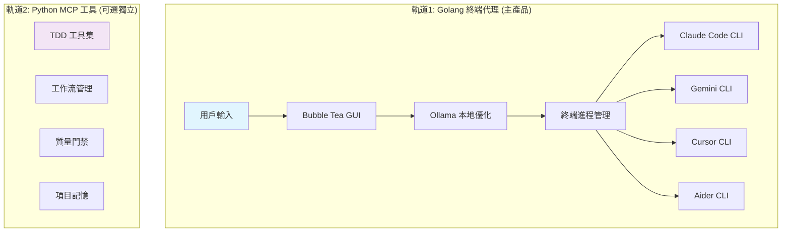

# 🤖 AI Terminal Proxy

*智能終端代理 - 統一所有 AI CLI 工具的終端界面*

[](LICENSE)
[](https://ollama.ai/)
[](https://github.com/charmbracelet/bubbletea)
[](https://modelcontextprotocol.io/)

## 🎯 核心理念：一個終端，統一所有 AI CLI 工具

### 當前 AI CLI 工具的核心痛點
- **🔄 工具切換複雜** - Claude Code、Cursor、Gemini CLI 各有不同命令和特性
- **💸 命令效率低** - 模糊指令導致 AI 理解偏差，浪費 token
- **🎮 學習成本高** - 每個工具都需要學習不同的命令體系
- **🔧 無法統一** - Claude Code 可自定義命令，Codex 不支援，功能割裂

### 🌟 我們的解決方案

**Golang 終端代理 + Ollama 本地優化 = 統一的 AI CLI 體驗**

```
用戶輸入 → Golang終端代理 → Ollama優化 → 指定AI CLI工具
   ↓           ↓             ↓          ↓
 /sync      GUI終端        智能優化    Claude/Cursor
 /plan     +會話管理       +本地處理   /Gemini等
```

### 💡 核心創新：GUI 終端管理 + 本地智能優化

我們採用雙軌獨立架構，提供最佳的開發體驗：

- **Golang 終端代理**：主要產品 - GUI 界面管理多個 AI 終端
- **Ollama 本地優化**：將模糊指令轉為精確命令，節省 token
- **多終端切換**：1-4 數字鍵快速在不同 AI 工具間切換
- **Python MCP 工具**：完全獨立的 TDD 工具集（可選）

## ✨ 核心特性

### 🎮 Golang 終端代理界面
```bash
# 基於 Bubble Tea 的 TUI 界面
┌─────────────────────────────────────────────────────────────┐
│ 🤖 AI Terminal Proxy v1.0 (Golang)                        │
├─────────────────┬─────────────────────┬───────────────────┤
│ 🖥️ 終端選擇      │ 📊 Ollama 狀態       │ 📈 優化統計        │
│ [1] Claude Code │ ✅ qwen2.5:14b      │ 今日優化: 45次    │
│ [2] Gemini CLI  │ 🔥 GPU加速 ON       │ Token節省: 67%    │
│ [3] Cursor      │ 📊 響應時間: 1.2s   │ 成功率: 94%      │
│ [4] Aider       │ 💾 緩存命中: 78%    │ 平均提升: 3.2x   │
├─────────────────┴─────────────────────┴───────────────────┤
│ 💬 統一命令輸入區                                          │
│ > /sync                         🔄 Ollama優化中...        │
│ > /plan "用戶登錄系統"           ✅ 已發送到 Claude Code    │
│ > "重構這個組件"                🎯 正在執行...            │
└─────────────────────────────────────────────────────────────┘
```

### 📋 智能命令路由
- **預定義命令**：將原 Claude Code 命令轉為通用模板
  - `/sync` - 恢復會話狀態
  - `/plan [需求]` - 制定實施計劃
  - `/update-spec` - 更新項目規格
  - `/context` - 載入項目上下文
- **智能路由**：根據命令類型自動選擇最合適的 AI CLI 工具
- **快速切換**：1-4 數字鍵快速切換終端

### 🧠 Ollama 本地優化
- **提示詞潤色**：將模糊指令轉為精確的技術描述
- **AI CLI 適配**：針對不同工具優化提示詞格式
- **本地處理**：100% 隱私保護，無數據外洩
- **緩存機制**：常用優化結果本地緩存，響應時間 < 2 秒

### 🖥️ 多終端進程管理
- **獨立會話**：每個 AI CLI 工具獨立運行，避免衝突
- **進程控制**：啟動/停止/重啟終端進程
- **狀態監控**：實時監控終端運行狀態
- **並行處理**：最多支援 4 個終端同時活躍

## 🏗️ 雙軌架構設計



### 軌道1: Golang 終端代理（主產品）
**核心功能**：
- **GUI 終端界面**：基於 [Bubble Tea](https://github.com/charmbracelet/bubbletea) 的現代 TUI
- **多終端管理**：PTY 控制，支援 Claude Code、Gemini CLI、Cursor、Aider
- **Ollama 集成**：本地 LLM 查詢優化，使用 [Ollama API](https://pkg.go.dev/github.com/ollama/ollama/api)
- **命令路由**：智能分發命令到最合適的 AI 工具

> 📋 **詳細技術棧和實現細節**: 請參考 [ARCHITECTURE.md#Golang-終端代理設計](ARCHITECTURE.md#🔧-golang-終端代理設計)

### 軌道2: Python MCP 工具（可選獨立）
**核心功能**：
- **TDD 驅動工具**：測試先行、質量門禁
- **ADDP 工作流**：Analysis → Design → Development → Persistence
- **項目記憶**：跨工具狀態同步
- **配置模板**：支援各種 AI 工具 MCP 配置

**使用方式**：
```bash
# 用戶自行配置到任何支援 MCP 的 AI 工具中
# 與 Golang 終端代理完全無關聯
```

> 📋 **詳細技術棧和工具介面**: 請參考 [ARCHITECTURE.md#Python-MCP-獨立服務設計](ARCHITECTURE.md#🐍-python-mcp-獨立服務設計)

## 🚀 快速開始

### 1. 環境準備
```bash
# 安裝 Ollama
curl -fsSL https://ollama.ai/install.sh | sh

# 下載推薦模型
ollama pull qwen2.5:14b

# 下載項目
git clone https://github.com/your-org/ai-terminal-proxy.git
cd ai-terminal-proxy
```

### 2. 啟動 Golang 終端代理
```bash
# 編譯並運行
go build -o claude-proxy ./cmd/proxy
./claude-proxy

# 或使用開發模式
go run ./cmd/proxy

# 輸出：
# 🤖 AI Terminal Proxy 正在啟動...
# ✅ Ollama 連接成功 (qwen2.5:14b)
# ✅ 檢測到 AI 工具: Claude Code ✓, Gemini CLI ✓, Cursor ✓
# 🎮 TUI 界面已打開
# 📊 準備就緒，可以開始使用！
```

### 3. 基本使用
```bash
# 在終端代理中使用
# Tab 鍵切換面板，1-4 數字鍵選擇終端
> /sync                              # 恢復會話狀態
> /plan "實作用戶註冊功能"             # 制定實施計劃
> /update-spec                       # 更新項目規格
> "優化這個React組件的性能"           # 自由輸入，自動優化並路由

# 快速終端切換
[1] → Claude Code
[2] → Gemini CLI
[3] → Cursor
[4] → Aider
```

### 4. 可選：Python MCP 工具
```bash
# 完全獨立安裝，不依賴 Golang 代理
pip install -e .

# 運行 MCP 服務
python -m src.mcp_server --stdio

# 根據使用的 AI 工具配置 MCP
# 詳見 docs/mcp_configuration.md
```

## 📂 項目結構

```
ai-terminal-proxy/
├── cmd/
│   └── proxy/                  # Golang 終端代理主程序
├── internal/
│   ├── gui/                    # Bubble Tea TUI 界面
│   ├── terminal/               # 終端進程管理
│   ├── optimizer/              # Ollama 查詢優化
│   └── router/                 # 命令路由分發
├── src/                        # Python MCP 工具（獨立）
│   ├── mcp_server/             # MCP 服務實現
│   ├── tools/                  # TDD 工具集
│   └── workflow/               # ADDP 工作流
├── scripts/
│   ├── install.sh              # 一鍵安裝腳本
│   └── test_integration.py     # 集成測試
└── docs/
    ├── golang_proxy.md         # Golang 代理使用指南
    ├── mcp_configuration.md    # Python MCP 配置指南
    └── troubleshooting.md      # 故障排除
```

## 📊 效果對比

| 指標 | 傳統方式 | Golang代理 | 改善幅度 |
|------|----------|------------|----------|
| 終端切換時間 | 30-60秒 | < 1秒 | -95% |
| 提問精準度 | 60% | 85-95% | +40-60% |
| Token 使用量 | 100% | 50-70% | -30-50% |
| 學習成本 | 高 | 低 | -80% |
| 隱私保護 | 部分 | 完全 | +100% |

## 🎯 支援的工具

### ✅ Golang 終端代理支援
- **Claude Code** - 完整命令支援
- **Gemini CLI** - 自然語言優化
- **Cursor** - 代碼編輯模式適配
- **Aider** - Git 工作流集成

### 🔶 Python MCP 可選集成
- **Claude Code** - 原生 MCP 支援
- **Cursor** - MCP 配置支援
- **其他 MCP 兼容工具** - 通用配置

## 🛣️ 開發路線圖

### 🎯 Week 1-2: Golang 終端代理核心
- [x] **基礎架構設計** - 雙軌架構定義
- [ ] **TUI 界面** - Bubble Tea 集成
- [ ] **終端管理** - PTY 控制和進程管理
- [ ] **Ollama 集成** - 查詢優化核心功能

### 🎯 Week 3-4: 多終端適配
- [ ] **Claude Code 適配** - 命令識別和優化
- [ ] **Gemini CLI 集成** - 自然語言處理
- [ ] **Cursor 支援** - 代碼編輯模式
- [ ] **Aider 適配** - Git 工作流

### 🎯 Week 5-6: Python MCP 獨立開發
- [ ] **MCP 服務框架** - 標準協議實現
- [ ] **TDD 工具集** - 測試驅動開發工具
- [ ] **配置模板** - 各 AI 工具配置指南
- [ ] **文檔完善** - 完整使用文檔

### 🎯 Week 7: 集成測試和部署
- [ ] **性能測試** - 響應時間和資源使用
- [ ] **兼容性測試** - 跨平台部署驗證
- [ ] **用戶體驗** - 5 分鐘上手測試
- [ ] **生產部署** - 一鍵安裝和配置

## 🤝 貢獻指南

### 🔧 Golang 終端代理
- **GUI 開發** - Bubble Tea TUI 界面優化
- **終端集成** - 新 AI CLI 工具適配
- **性能優化** - Ollama 查詢優化算法

### 🐍 Python MCP 工具
- **工具開發** - TDD 工具集擴展
- **工作流設計** - ADDP 流程優化
- **配置模板** - 支援更多 AI 工具

### 📝 文檔和測試
- **使用指南** - 實際使用案例
- **測試覆蓋** - 功能和集成測試
- **性能基準** - 效果對比分析

## 📄 項目文檔

- [**ARCHITECTURE.md**](ARCHITECTURE.md) - 雙軌架構詳細設計與驗收標準 (DoD)
- [**DEVELOPMENT_PLAN.md**](DEVELOPMENT_PLAN.md) - 開發計劃和時程安排
- [**TECH_STACK.md**](TECH_STACK.md) - 技術選型說明
- [**CLAUDE.md**](CLAUDE.md) - 項目協作規範

### 📋 詳細技術規格
如需了解具體的技術實現細節、介面定義和驗收標準，請參考：
- **目標與驗收標準**: [ARCHITECTURE.md#目標與驗收標準](ARCHITECTURE.md#🎯-目標與驗收標準-objectives--dod)
- **最小可行工具集**: [ARCHITECTURE.md#最小可行工具集](ARCHITECTURE.md#最小可行工具集-minimum-viable-toolset)
- **完整 DoD 清單**: [ARCHITECTURE.md#完成定義](ARCHITECTURE.md#完成定義-definition-of-done)

## 📧 聯繫我們

- **Issues** - [GitHub Issues](https://github.com/your-org/ai-terminal-proxy/issues)
- **Discussions** - [GitHub Discussions](https://github.com/your-org/ai-terminal-proxy/discussions)

## 📜 許可證

本項目採用 [MIT License](LICENSE) 開源許可證。

---

**🚀 重新定義 AI CLI 工具的使用方式！**

*一個終端，統一所有 AI 工具 - 更快速、更智能、更安全*