# Claude Code 協作規範體系 v4.0 - 混合命令+代理系統

*[English](README.md) | 中文*

> **革命性AI驅動開發框架**  
> 結合精確命令控制與智能代理自動化，提升開發生產力

本文檔整合了 Claude Code 的所有核心內容，包括命令系統、協作規範、使用指南等。

## 📚 目錄

### 🚀 立即開始
1. [v4.0 混合系統架構](#-v40-混合系統架構) 🔥 **最新革命性突破**
2. [智能代理系統](#-智能代理系統) ⭐ **35+專業代理自動支援**
3. [Output Styles 系統](#-output-styles-系統) 🎨 **個性化轉換**
4. [快速開始](#-快速開始) ⚡ **5分鐘上手**
5. [混合工作流程](#-混合工作流程) 🔥 **全新協作模式**

### 📖 實用參考
6. [命令快速索引](#-命令快速索引) 📋 **快速查找**
7. [命令系統 v3.3](#-命令系統-v33) 📚 **核心保留**
8. [項目結構](#-項目結構)
9. [協作憲法](#-協作憲法)
10. [最佳實踐](#-最佳實踐)

### 📚 詳細文檔
10. [命令詳細使用手冊](#-命令詳細使用手冊)
11. [使用指南](#-使用指南)

### 🔄 版本與遷移
12. [遷移指南](#-遷移指南) 🔄 **v3.3→v4.0無縫升級**
13. [版本歷史](#-版本歷史) 📊 **完整版本記錄**

## 🚀 快速開始

### 5分鐘上手

#### A. 新項目
```bash
# 使用元工作流命令
/meta

# Claude 會：
# 1. 分析項目特徵
# 2. 詢問關鍵信息
# 3. 自動生成 CLAUDE.md
# 4. 建立文檔結構
```

#### B. 現有項目
```bash
# 直接理解項目
/start

# 或恢復之前的工作狀態
/sync
```

#### C. 安裝選項

##### 自動安裝（推薦）
```bash
# Windows
cd claude\commands\deploy-package
.\deploy.ps1

# macOS/Linux
cd claude/commands/deploy-package
./deploy.sh
```

##### 手動安裝
```bash
# 1. 複製代理到 Claude 主目錄
# Windows
xcopy /E /I "claude\agents" "%USERPROFILE%\.claude\agents"

# macOS/Linux  
cp -r claude/agents ~/.claude/agents

# 2. 複製命令（可選 - 用於命令系統）
# Windows
xcopy /E /I "claude\commands\deploy-package\global" "%USERPROFILE%\.claude\commands"

# macOS/Linux
cp -r claude/commands/deploy-package/global ~/.claude/commands

# 3. 驗證安裝
ls ~/.claude/agents/      # 應該看到代理 .md 文件
ls ~/.claude/commands/    # 應該看到命令文件（如果安裝了）
```

##### 項目特定安裝
```bash
# 複製到項目根目錄以進行項目特定配置
cp -r claude/agents .claude/agents
```

### 🔍 命令快速索引

| 類別 | 命令 | 功能簡述 | 跳轉 |
|------|------|---------|------|
| **項目理解** | `/start` | 快速理解新項目 | [詳情](#1-start---項目快速啟動與理解) |
| | `/sync` | 恢復工作狀態 | [詳情](#2-sync---狀態同步器) |
| | `/context` | 確認理解一致 | [詳情](#3-context---上下文同步檢查點) |
| **開發輔助** | `/plan` | 任務規劃分解 | [詳情](#4-plan---任務規劃與設計) |
| | `/check` | 完整質量檢查 | [詳情](#5-check---完整質量檢查) |
| | `/watch` | 監察模式 | [詳情](#6-watch---監察模式) |
| | `/test` | 測試生成執行 | [詳情](#7-test---測試生成與執行) |
| **問題解決** | `/debug` | 錯誤快速定位 | [詳情](#8-debug---智能調試助手) |
| | `/analyze` | 深度風險分析 | [詳情](#13-analyze---深度分析與驗證) |
| **知識管理** | `/learn` | 記錄技術決策 | [詳情](#9-learn---學習並記錄決策) |
| | `/doc` | 文檔智能維護 | [詳情](#10-doc---智能文檔維護) |
| **工作流程** | `/review` | PR 準備助手 | [詳情](#11-review---pr-準備助手) |
| | `/meta` | 項目規範定制 | [詳情](#12-meta---項目規範定制) |
| | `/update-spec` | 規範更新管理 | [詳情](#14-update-spec---claudemd-更新專用) |
| **SDK 開發** | `/sdk-design` | API 設計指導 | [詳情](#1-sdk-design---api-設計助手) |
| | `/sdk-example` | 示例代碼生成 | [詳情](#2-sdk-example---示例代碼生成) |
| | `/sdk-test` | 測試套件生成 | [詳情](#3-sdk-test---sdk-測試套件) |
| | `/sdk-doc` | SDK 文檔生成 | [詳情](#4-sdk-doc---sdk-文檔生成) |
| | `/sdk-release` | 發布準備檢查 | [詳情](#5-sdk-release---發布準備助手) |

---

## 🚀 v4.0 混合系統架構

### 革命性突破：命令 + 代理雙軌系統

Claude Code v4.0 引入了**混合命令+代理系統**，將傳統命令系統的精確控制與智能代理的專業能力完美結合。

#### 🏗️ 系統設計理念

**命令系統** (人類主導)：
- 項目生命週期管理
- 記憶和狀態控制
- 規範制定和更新
- 關鍵決策點控制

**代理系統** (AI 智能化)：
- 技術專業知識
- 自動質量保證
- 上下文感知觸發
- 持續監控和優化

### 🎯 核心優勢

1. **智能路由**：根據文件類型和代碼內容自動選擇合適的專業代理
2. **專業深度**：35+ 專業代理覆蓋全技術棧
3. **零配置**：智能上下文檢測，無需手動配置
4. **漸進式**：可與現有命令系統並存，逐步遷移

### 📊 系統架構圖

```mermaid
graph TD
    A[用戶請求] --> B[命令系統 v3.3]
    A --> C[代理系統 v4.0]
    
    B --> D[項目管理]
    B --> E[記憶控制]
    B --> F[規範制定]
    
    C --> G[智能上下文檢測]
    G --> H[專業代理路由]
    H --> I[質量保證代理]
    H --> J[開發輔助代理]
    H --> K[技術專家代理]
    
    D -.協作.-> H
    E -.協作.-> G
    F -.協作.-> I
```



---

## 🤖 智能代理系統

### ⚠️ 重要更新：配置變更

**已移除文件** (2025-08-16)：
- `config/triggers.yaml` - **已移除**：Claude Code 不會解析自定義 YAML 觸發配置
- `config/workflows.yaml` - **已移除**：工作流編排由 Claude Code 內部處理
- Context detector agents - **已棄用**：基於文件的檢測不如預期工作

**為什麼移除這些文件**：
1. **沒有執行引擎**：Claude Code 沒有機制來解析和執行這些自定義配置
2. **與實際不符**：這些文件暗示基於文件類型的自動觸發，但實際上不起作用
3. **Subagents 工作方式不同**：Claude Code 使用代理描述進行自動委派，而不是基於文件的觸發器

**實際有效的方式**：
- 具有包含觸發關鍵字的清晰 `description` 欄位的代理
- Claude Code 基於任務上下文的內建自動委派
- 使用 "Use the [agent-name] agent" 進行顯式代理調用

### 代理分類與能力

#### ~~🧠 上下文檢測器 (Context Detectors)~~ （已棄用）
~~智能分析代碼上下文，解決多用途語言場景衝突~~

**注意**：上下文檢測器代理已被棄用。請改用特定語言的專家代理（例如 `kotlin-expert`、`python-ml-specialist`）

#### 💻 技術專家代理 (Technical Specialists)
針對你的技術棧提供專業支援：

**Android & Kotlin**
- `android-kotlin-architect`: Android 應用開發專家
- `kotlin-polyglot-master`: Kotlin 全平台專家
- `ktor-backend-architect`: Ktor 後端服務專家

**系統程式設計**
- `golang-systems-engineer`: Go 系統工程專家
- `rust-zero-cost`: Rust 零成本抽象專家
- `cpp-modern-master`: 現代 C++ 專家

**機器學習 & 數據科學**
- `python-ml-specialist`: Python ML/AI 專家
- 支援 PyTorch、TensorFlow、Scikit-learn、LangChain

**遊戲開發**
- `unity-csharp-expert`: Unity 遊戲開發專家

**前端開發**
- React、Vue、Angular、Next.js 等框架專家

#### 🔍 質量保證代理 (Quality Assurance)
專業的代碼審查和質量控制：

- **code-reviewer**: 全面代碼審查，安全和性能分析
- **test-automator**: 智能測試生成和執行
- **performance-optimizer**: 性能瓶頸分析和優化建議
- **jenny-validator**: 規格驗證專家（靈感來自 ClaudeCodeAgents）
- **karen-realist**: 現實評估專家，時程和範圍把關

#### 🎭 工作流程代理 (Workflow Agents)
- **work-coordinator**: 多代理協調者，處理複雜跨領域任務

### 🔄 ~~智能觸發系統~~ （已棄用）

**此部分已過時**。Claude Code 的實際委派工作方式不同：
- 基於任務描述和代理的 `description` 欄位
- 不是基於文件類型或代碼模式
- 在代理描述中使用清晰的關鍵字以獲得更好的自動委派

### 🎯 智能檢測範例

#### Kotlin 多場景識別
```kotlin
// 場景1: Android 應用 -> android-kotlin-architect
import android.os.Bundle
import androidx.compose.runtime.*

// 場景2: Ktor 後端 -> ktor-backend-architect  
import io.ktor.server.application.*
import io.ktor.server.routing.*

// 場景3: Spring Boot -> spring-boot-kotlin-expert
@SpringBootApplication
@RestController
class UserController
```

#### Python 上下文智能識別
```python
# 場景1: 機器學習 -> python-ml-specialist
import torch
import transformers
from sklearn.model_selection import train_test_split

# 場景2: FastAPI 後端 -> fastapi-developer
from fastapi import FastAPI
from pydantic import BaseModel

# 場景3: 數據科學 -> data-scientist
import pandas as pd
import matplotlib.pyplot as plt
import seaborn as sns
```

---

## 🎨 Output Styles 系統

### 為任何領域轉換 Claude 的個性

Output Styles 能夠完全轉換 Claude Code 的個性，同時保留所有工具和能力。這個強大的功能讓你可以自定義 Claude 的溝通風格、回應格式和領域專業知識，以滿足你的特定需求。

### Output Styles 工作原理

Output Styles 通過替換 Claude Code 的系統提示詞來重塑其個性和方法。設置會在項目級別持久化（保存到 `.claude/settings.local.json`），讓不同項目可以維持不同的個性。

### 可用的專業風格

| 風格名稱 | 最適合 | 關鍵特徵 |
|---------|--------|---------|
| **Senior Architect** | 系統設計與架構 | 戰略思維、風險評估、全面分析 |
| **Concise Developer** | 快速編碼任務 | 直接解決方案、最少解釋、代碼優先 |
| **Educational Mentor** | 學習與教學 | 循序漸進指導、詳細解釋、練習題 |
| **DevOps Engineer** | 基礎設施與部署 | 自動化優先、可靠性焦點、IaC 思維 |
| **Security Analyst** | 安全審查 | 威脅建模、漏洞評估、合規焦點 |

### 安裝與配置

#### 方法 1：自動安裝（推薦）
部署腳本會同時安裝命令和 Output Styles：

```bash
# Windows
cd claude\commands\deploy-package
.\deploy.ps1

# macOS/Linux
cd claude/commands/deploy-package
./deploy.sh
```

這將會：
- 複製所有 Output Styles 到 `~/.claude/output-styles/`
- 複製所有命令到 `~/.claude/commands/`
- 驗證安裝並提供使用提示

#### 方法 2：手動安裝
如需更精確控制安裝過程：

**Windows:**
```powershell
# 創建 Output Styles 目錄
mkdir "%USERPROFILE%\.claude\output-styles"

# 複製所有風格文件
xcopy /Y "claude\output-styles\*.md" "%USERPROFILE%\.claude\output-styles\"

# 驗證安裝
dir "%USERPROFILE%\.claude\output-styles"
```

**macOS/Linux:**
```bash
# 創建 Output Styles 目錄
mkdir -p ~/.claude/output-styles

# 複製所有風格文件
cp claude/output-styles/*.md ~/.claude/output-styles/

# 設置正確權限
chmod 644 ~/.claude/output-styles/*.md

# 驗證安裝
ls -la ~/.claude/output-styles/
```

**選擇性安裝:**
```bash
# 只安裝特定風格
cp claude/output-styles/senior-architect.md ~/.claude/output-styles/
cp claude/output-styles/concise-developer.md ~/.claude/output-styles/
```

### 使用 Output Styles

#### 基本命令
```bash
/output-style              # 查看可用風格
/output-style:set <name>   # 設置特定風格
/output-style:new          # 創建新的自定義風格
```

#### 配置選項

**1. 命令行使用**（立即生效）
```bash
/output-style:set senior-architect
```

**2. 項目級別配置**（項目持久化）
創建或編輯 `.claude/settings.local.json`：
```json
{
  "outputStyle": "concise-developer",
  "permissions": {
    "defaultMode": "acceptEdits"
  }
}
```

**3. 全局默認配置**（所有項目）
編輯 `~/.claude/settings.json`：
```json
{
  "defaultOutputStyle": "educational-mentor"
}
```

**優先級順序：** 命令 > 項目配置 > 全局配置 > 默認

#### 工作流整合示例

**架構規劃**
```bash
/output-style:set senior-architect
/plan 設計微服務架構
# → 全面分析包含風險評估、權衡分析和路線圖
```

**快速開發**
```bash
/output-style:set concise-developer
# 開始編碼，最少解釋，直接解決方案
```

**團隊培訓**
```bash
/output-style:set educational-mentor
/learn 記錄 Redis 緩存策略
# → 詳細解釋包含示例和最佳實踐
```

### 最佳風格 + 命令組合

| 任務類型 | 推薦風格 | 最佳命令 | 結果 |
|---------|---------|---------|------|
| 架構設計 | Senior Architect | `/plan`、`/meta` | 戰略規劃與全面分析 |
| 功能實現 | Concise Developer | `/context`、編碼 | 快速高效開發 |
| 知識傳遞 | Educational Mentor | `/learn`、`/doc` | 清晰文檔與學習進程 |
| 部署設置 | DevOps Engineer | 部署任務 | 自動化、可靠的基礎設施 |
| 安全審計 | Security Analyst | 代碼審查 | 徹底的漏洞評估 |

### 創建自定義風格

你可以創建適合團隊需求的自定義風格：

```bash
/output-style:new
# 描述你的需求，Claude 會生成自定義風格
```

自定義風格保存為帶有 YAML frontmatter 的 markdown 文件：
```markdown
---
description: 風格簡短描述
---

# 風格名稱

詳細的系統提示詞，定義溝通風格、
回應格式和領域特定行為...
```

### 最佳實踐

1. **階段性切換**：為不同開發階段使用不同風格
2. **項目一致性**：在 `.claude/settings.local.json` 中為每個項目設置默認風格
3. **團隊協調**：與團隊共享自定義風格以保持一致的交互
4. **結合命令**：利用風格 + 命令組合獲得最大效率

### Output Styles vs 代理

| 方面 | Output Styles | 代理 |
|------|--------------|------|
| **範圍** | 轉換主 Claude 實例 | 獨立的專業助手 |
| **持久性** | 項目級別設置 | 任務特定激活 |
| **控制** | 直接交互與自定義個性 | 自動委派 |
| **用例** | 一致的溝通風格 | 專業技術任務 |

Output Styles 和代理協同工作：Styles 定義 Claude 如何溝通，而代理決定應用什麼專業能力。

📖 **[完整 Output Styles 指南](output-styles/README.md)** - 進階配置、自定義風格創建和故障排除

---

## 🚀 快速開始

### 5 分鐘內開始使用 Claude Code

#### A. 新項目
```bash
# 使用元工作流命令
/meta

# Claude 會：
# 1. 分析項目特徵
# 2. 詢問關鍵信息
# 3. 自動生成 CLAUDE.md
# 4. 設置文檔結構
```

#### B. 現有項目
```bash
# 直接理解項目
/start

# 或恢復之前的工作狀態
/sync
```

#### C. 安裝命令系統
```bash
# Windows
cd claude\commands\deploy-package
.\deploy.ps1

# macOS/Linux
cd claude/commands/deploy-package
./deploy.sh
```

---

## 🎯 命令系統 v3.3 + SDK 擴展

### 🆕 v3.1 狀態管理增強（最新）
- **完整生命週期**：`/plan` 創建會話 → `/update-spec` 終結週期
- **狀態連貫性**：`last-session.yml` 追踪完整開發週期
- **進度追踪**：`/context` 對比 `initial-scan.json` 基線顯示進展
- **健壯恢復**：`/sync` 優雅處理缺失文件並智能降級

### 核心理念
- **少即是多**：通用命令 14 個 + SDK 專用 5 個
- **智能整合**：每個命令完成多項相關任務
- **上下文感知**：通過結構化文件自動管理記憶和狀態
- **場景適配**：應用開發和 SDK 開發雙軌支援

### 14 個通用命令（全局通用）

#### 項目理解與管理（3個）
| 命令 | 功能 | 使用時機 | 參數 |
|------|------|----------|------|
| `/start` | 項目快速啟動與理解 | 初次接觸項目 | 無 |
| `/context` | 上下文同步檢查點 | 確保理解一致 | 無 |
| `/sync` | 狀態同步器 | 新會話開始 | 無 |

#### 開發輔助（4個）
| 命令 | 功能 | 使用時機 | 參數 |
|------|------|----------|------|
| `/plan` | 任務規劃與設計 | 開始新功能前 | [任務描述] |
| `/check` | 完整質量檢查 | 提交代碼前 | 無 |
| `/watch` | 監察模式 | 編碼過程中 | [on\|off\|status\|report] |
| `/test` | 測試生成與執行 | 確保代碼質量 | [文件\|功能] |

#### 知識管理（2個）
| 命令 | 功能 | 使用時機 | 參數 |
|------|------|----------|------|
| `/learn` | 學習並記錄決策 | 重要決定後 | [決策內容] |
| `/doc` | 智能文檔維護 | 更新項目文檔 | [api\|readme\|changelog\|arch] |

#### 工作流優化（3個）
| 命令 | 功能 | 使用時機 | 參數 |
|------|------|----------|------|
| `/review` | PR 準備助手 | 創建 PR 前 | 無 |
| `/debug` | 智能調試助手 | 遇到問題時 | [錯誤信息] |
| `/meta` | 項目規範定制 | 新項目或重大變更 | 無 |

#### 質量保證（2個）
| 命令 | 功能 | 使用時機 | 參數 |
|------|------|----------|------|
| `/analyze` | 深度分析與驗證 | 基於經驗直覺的風險分析 | [功能/模組] [疑慮或"deep"] |
| `/update-spec` | CLAUDE.md 更新專用 | 固化決策為規範 | [review\|section "content"] |

### 🆕 SDK 開發專用命令（5個）

專為 SDK/Library 開發設計的命令集：

#### SDK 專用命令
| 命令 | 功能 | 使用時機 | 參數 |
|------|------|----------|------|
| `/sdk-design` | API 設計助手 | 設計新 API 時 | [功能描述] |
| `/sdk-example` | 示例代碼生成 | 創建使用示例 | [basic\|advanced\|integration\|all] |
| `/sdk-test` | SDK 測試套件 | 生成專業測試 | [unit\|integration\|compat\|performance\|all] |
| `/sdk-doc` | SDK 文檔生成 | 編寫文檔時 | [api\|guide\|migration\|all] |
| `/sdk-release` | 發布準備助手 | 準備新版本 | [major\|minor\|patch\|check] |


---

## 📁 項目結構

```
claude/
├── README.md                    # 本文檔（v4.0 混合系統完整版）
│
├── output-styles/              # 🎨 Output Styles 系統
│   ├── senior-architect.md     # 戰略架構風格
│   ├── concise-developer.md    # 極簡編碼風格
│   ├── educational-mentor.md   # 教學學習風格
│   ├── devops-engineer.md      # 基礎設施自動化風格
│   └── security-analyst.md     # 安全焦點風格
│
├── agents/                     # 🤖 智能代理系統 v4.0
│   ├── README.md               # 代理系統說明
│   ├── core/                   # 核心代理
│   │   ├── code-reviewer.md    # 代碼審查專家
│   │   ├── performance-optimizer.md # 性能優化專家
│   │   └── test-automator.md   # 測試自動化專家
│   ├── languages/              # 語言專家代理
│   │   ├── kotlin-context-detector.md # Kotlin 上下文檢測器
│   │   ├── kotlin-polyglot-master.md  # Kotlin 全平台專家
│   │   ├── android-kotlin-architect.md # Android 開發專家
│   │   ├── java-context-detector.md    # Java 上下文檢測器
│   │   ├── csharp-context-detector.md  # C# 上下文檢測器
│   │   ├── javascript-context-detector.md # JS/TS 上下文檢測器
│   │   ├── python-context-detector.md  # Python 上下文檢測器
│   │   ├── python-ml-specialist.md     # Python ML/AI 專家
│   │   ├── golang-systems-engineer.md # Go 系統工程專家
│   │   ├── rust-zero-cost.md          # Rust 零成本專家
│   │   └── cpp-modern-master.md       # 現代 C++ 專家
│   ├── frameworks/             # 框架專家代理
│   │   └── ktor-backend-architect.md  # Ktor 後端專家
│   ├── quality/                # 質量保證代理
│   │   ├── jenny-validator.md  # 規格驗證專家
│   │   └── karen-realist.md    # 現實評估專家
│   └── workflow/               # 工作流程代理
│       └── work-coordinator.md # 多代理協調者
│
├── config/                     # 🔧 配置系統
│   └── token-settings.yaml     # Token 優化設置
│
├── commands/                   # 📋 命令系統 v3.3（核心保留）
│   └── deploy-package/         # 命令部署包
│       ├── DEPLOY_GUIDE.md     # 部署指南
│       ├── CHANGELOG.md        # 版本歷史
│       ├── SIMPLE_COMMANDS_SUMMARY.md # 命令系統說明
│       ├── deploy.ps1          # Windows 部署腳本
│       ├── deploy.sh           # macOS/Linux 部署腳本
│       ├── global/             # 核心保留命令 (8個)
│       │   ├── context.md      # ✅ 保留：上下文同步
│       │   ├── doc.md          # ✅ 保留：文檔維護
│       │   ├── learn.md        # ✅ 保留：決策記錄
│       │   ├── meta.md         # ✅ 保留：項目規範制定
│       │   ├── plan.md         # ✅ 保留：任務規劃
│       │   ├── start.md        # ✅ 保留：項目理解
│       │   ├── sync.md         # ✅ 保留：狀態恢復
│       │   └── update-spec.md  # ✅ 保留：規範更新
│       └── sdk/                # 5 個 SDK 專用命令
│           ├── sdk-design.md   # SDK 設計助手
│           ├── sdk-doc.md      # SDK 文檔生成
│           ├── sdk-example.md  # SDK 示例生成
│           ├── sdk-release.md  # SDK 發布助手
│           └── sdk-test.md     # SDK 測試套件
│
├── commands-legacy/            # 🗄️ 命令歷史歸檔
│   ├── README.md               # 歸檔說明和遷移指南
│   └── v3.3-archive/           # v3.3 完整命令備份
│       └── deploy-package/     # 完整的 v3.3 命令系統
│
├── constitution/               # 🏛️ 憲法體系（參考）
│   └── CLAUDE_CONSTITUTION.md  # Claude 協作憲法完整版
│
├── guides/                     # 📖 深入指南（進階參考）
│   ├── AI_ASSISTANT_COMPARISON.md    # AI 助手對比
│   ├── COMMAND_WRITING_GUIDE.md       # 命令編寫指南
│   ├── CONSTITUTION_SYNC_GUIDE.md     # 憲法同步指南
│   ├── CONSTITUTION_USAGE_GUIDE.md    # 憲法使用指南
│   ├── DOCUMENT_STRUCTURE_STANDARD.md # 文檔結構規範
│   ├── LEGACY_PROJECT_ONBOARDING.md   # 遺留項目接入
│   ├── MARKET_ANALYSIS.md             # 市場分析
│   ├── NEW_VS_LEGACY_PROJECT.md       # 新舊項目對比
│   └── SDK_DEVELOPMENT_WORKFLOW.md    # SDK 開發工作流
│
└── templates/                  # 📝 模板文件
    ├── CLAUDE_MD_TEMPLATE.md   # CLAUDE.md 通用模板
    └── SDK_PROJECT_TEMPLATE.md # SDK 項目專用模板
```

### 📝 文檔說明
- **README.md**：v4.0 混合系統完整文檔，包含命令與代理使用指南
- **agents/**：智能代理系統，自動觸發，專業支援
- **config/**：觸發配置和工作流程定義
- **commands/deploy-package/**：核心保留命令的部署系統
- **commands-legacy/**：歷史命令歸檔，供參考和特殊用途
- **guides/**：深入的專題指南，需要時參考
- **templates/**：項目初始化時使用的模板

---

## 🏛️ 協作憲法

### 核心理念
Claude Code 的協作基於以下原則：

1. **上下文優先**：保持理解的連續性
2. **知識積累**：記錄決策，避免重複
3. **漸進改進**：小步快跑，持續優化
4. **人機協作**：明確分工，發揮各自優勢

### 工作模式

#### 開發工作流
1. **理解階段**：`/start` 或 `/sync`
2. **規劃階段**：`/plan` 任務分解
3. **實施階段**：編碼實現
4. **驗證階段**：`/check` 和 `/test`
5. **知識沉澱**：`/learn` 記錄決策

#### 元工作流
用於建立和更新項目規範：
1. **評估項目**：技術棧、團隊、複雜度
2. **定制規範**：生成項目特定的 CLAUDE.md
3. **持續優化**：根據實踐調整規範

---

## 📖 使用指南

### 📘 命令詳細使用手冊

#### 1. `/start` - 項目快速啟動與理解

**使用場景**：
- 首次接觸一個新項目
- 需要快速理解項目結構
- 接手他人的代碼庫

**具體用法**：
```bash
/start
```

**預期輸出**：
- 項目類型識別（Web/API/SDK/工具等）
- 技術棧分析（語言、框架、依賴）
- 目錄結構解析
- 關鍵文件定位
- 自動創建 `.claude/PROJECT_CONTEXT.md`

**實際案例**：
```bash
# 接手一個 React 項目
/start
> 識別為：React Web 應用
> 技術棧：React 18, TypeScript, Vite
> 主要模組：components/, pages/, services/
> 入口文件：src/main.tsx
> 已創建項目上下文文件
```

---

#### 2. `/sync` - 狀態同步器

**使用場景**：
- 開始新的工作會話
- 切換到不同分支後
- 長時間中斷後恢復工作

**具體用法**：
```bash
/sync
```

**預期輸出**：
- 載入項目上下文
- 恢復決策記錄
- 顯示當前工作狀態
- 提醒待完成任務

**實際案例**：
```bash
/sync
> 恢復項目：電商平台 v2.0
> 當前分支：feature/payment
> 最近決策：選用 Stripe 支付
> 待完成：支付回調處理
```

---

#### 3. `/context` - 上下文同步檢查點

**使用場景**：
- 確認 Claude 理解是否正確
- 重大變更後同步認知
- 團隊成員交接時

**具體用法**：
```bash
/context
```

**預期輸出**：
- 當前理解的項目狀態
- 最近的變更摘要
- 待確認的假設

**實際案例**：
```bash
/context
> 當前理解：
> - 正在實現用戶認證模組
> - 使用 JWT token 方案
> - 需要支援 OAuth2.0
> 請確認以上理解是否正確？
```

---

#### 4. `/plan` - 任務規劃與設計

**使用場景**：
- 開始新功能開發
- 重構現有代碼
- 解決複雜問題

**具體用法**：
```bash
/plan "任務描述"
```

**預期輸出**：
- 分解的子任務列表
- 實施順序建議
- 潛在風險提示
- 時間估算

**實際案例**：
```bash
/plan "實現購物車功能"
> 任務分解：
> 1. 設計購物車數據模型 (2h)
> 2. 實現添加商品 API (1h)
> 3. 實現數量修改 API (1h)
> 4. 實現刪除商品 API (0.5h)
> 5. 添加庫存檢查邏輯 (1h)
> 6. 實現價格計算 (1.5h)
> 7. 編寫單元測試 (2h)
> 風險：併發修改可能導致超賣
```

---

#### 5. `/check` - 完整質量檢查

**使用場景**：
- 提交代碼前的全面檢查
- Code Review 前的自檢
- 定期的質量審計
- 與 `/guardian` 配合使用

**具體用法**：
```bash
/check
```

**預期輸出**：
- 代碼風格問題
- 潛在 bug
- 性能優化建議
- 安全漏洞警告
- 質量評分報告

**實際案例**：
```bash
/check
> ✅ 代碼風格：符合 ESLint 規範
> ⚠️ 性能：發現 N+1 查詢 (user.service.ts:45)
> ❌ 安全：SQL 注入風險 (db.query.ts:23)
> 💡 建議：使用參數化查詢
```

---

#### 6. `/watch` - 監察模式（協作式質量守護）

**使用場景**：
- 編碼過程中的持續關注
- 需要主動提交代碼觸發檢查
- 建立良好的檢查習慣
- 與 `/check` 形成完整質量保證

**具體用法**：
```bash
/watch on      # 開啟監察模式
/watch off     # 關閉監察模式
/watch status  # 查看當前狀態
/watch report  # 生成監察報告
```

**預期輸出**：
- 即時安全警告
- 代碼質量提醒
- 性能風險提示
- 最佳實踐建議

**實際案例**：
```bash
/watch on
> 監察模式已開啟，請在編碼時定期提交代碼片段

"我剛寫了用戶驗證函數：[貼上代碼]"
> 🔴 發現安全問題：密碼未加密存儲
> 💡 建議使用 bcrypt 加密

"已修復，現在使用 bcrypt：[貼上修復後代碼]"
> ✅ 安全問題已解決

/watch status
> 監察時長：45分鐘
> 發現問題：3個（已修復2個）
```

**與 /check 的配合**：
```bash
/watch on       # 開始編碼前開啟監察
[編碼過程中持續提交和獲得反饋...]
/check          # 完成後執行完整檢查
/watch off      # 結束工作關閉監察
```

**重要說明**：
ℹ️ `/watch` 並非真正的實時監控，需要您主動提交代碼片段來觸發檢查。這是一個協作式的工作模式，幫助您在編碼過程中保持質量意識。

---

#### 7. `/test` - 測試生成與執行

**使用場景**：
- 為新功能編寫測試
- 補充測試覆蓋率
- 驗證 bug 修復

**具體用法**：
```bash
/test [文件|功能]
```

**預期輸出**：
- 生成的測試代碼
- 測試執行結果
- 覆蓋率報告
- 邊界條件測試

**實際案例**：
```bash
/test "UserService"
> 生成 5 個測試用例：
> ✅ should create user successfully
> ✅ should validate email format
> ✅ should hash password
> ❌ should handle duplicate email
> ✅ should update last login time
> 覆蓋率：87%
```

---

#### 8. `/debug` - 智能調試助手

**使用場景**：
- 遇到錯誤需要定位
- 性能問題排查
- 異常行為分析

**具體用法**：
```bash
/debug "錯誤信息或問題描述"
```

**預期輸出**：
- 問題原因分析
- 可能的解決方案
- 調試步驟建議
- 相關代碼定位

**實際案例**：
```bash
/debug "TypeError: Cannot read property 'id' of undefined"
> 問題定位：components/UserCard.tsx:15
> 原因：未檢查 user 對象是否存在
> 解決方案：
> 1. 添加可選鏈：user?.id
> 2. 或添加條件檢查：if (user && user.id)
> 3. 設置默認值：user = user || {}
```

---

#### 9. `/learn` - 學習並記錄決策

**使用場景**：
- 重要技術選型後
- 解決關鍵問題後
- 發現最佳實踐時

**具體用法**：
```bash
/learn "決策內容或經驗"
```

**預期輸出**：
- 更新 DECISIONS.md
- 智能分類標籤
- 關聯影響分析

**實際案例**：
```bash
/learn "選擇 PostgreSQL 而非 MongoDB，因為需要強一致性事務"
> ✅ 已記錄到 DECISIONS.md
> 標籤：#數據庫 #架構決策
> 影響：需要設計關係型表結構
> 相關文件：database/schema.sql
```

---

#### 10. `/doc` - 智能文檔維護

**使用場景**：
- 更新 API 文檔
- 維護 README
- 生成變更日誌

**具體用法**：
```bash
/doc [api|readme|changelog|arch]
```

**預期輸出**：
- 自動更新指定文檔
- 保留手動編輯內容
- 生成缺失部分

**實際案例**：
```bash
/doc api
> 掃描到 15 個 API 端點
> 更新 3 個新端點文檔
> 修正 2 個過時的參數說明
> 生成 Postman 集合
> 文檔位置：docs/api/README.md
```

---

#### 11. `/review` - PR 準備助手

**使用場景**：
- 創建 Pull Request 前
- 需要自我審查時
- 準備 code review

**具體用法**：
```bash
/review
```

**預期輸出**：
- 變更摘要
- PR 描述模板
- 檢查清單
- 潛在問題提醒

**實際案例**：
```bash
/review
> 變更摘要：
> - 新增：購物車功能模組
> - 修改：訂單服務接口
> - 刪除：廢棄的支付方法
> 
> PR 描述：
> ## 功能
> 實現完整購物車功能
> 
> ## 測試
> - [x] 單元測試通過
> - [x] 集成測試通過
> 
> ⚠️ 提醒：記得更新 API 文檔
```

---

#### 12. `/meta` - 項目規範定制

**使用場景**：
- 新項目初始化
- 團隊規範制定
- 技術棧變更時

**具體用法**：
```bash
/meta
```

**預期輸出**：
- 生成 CLAUDE.md
- 項目特定規範
- 工作流程定義

**實際案例**：
```bash
/meta
> 分析項目特徵...
> 識別為：Node.js 微服務
> 生成規範：
> - API 設計原則
> - 錯誤處理規範
> - 日誌記錄標準
> - 測試要求
> 已創建 CLAUDE.md
```

---

#### 13. `/analyze` - 深度分析與驗證

**使用場景**：
- 功能完成但有疑慮時
- 需要風險評估時
- 性能瓶頸分析

**具體用法**：
```bash
/analyze "功能/模組" ["具體疑慮"或"deep"]
```

**預期輸出**：
- 風險等級評估
- 邊界條件分析
- 改進建議
- 測試場景

**實際案例**：
```bash
/analyze "支付系統" "併發安全"
> 🚨 高風險：
> - 重複支付可能（無冪等性保證）
> - 金額計算存在浮點誤差
> 
> ⚠️ 中風險：
> - 超時處理不完善
> 
> 建議：
> 1. 添加分佈式鎖
> 2. 使用 BigDecimal
> 3. 實現冪等性檢查
```

---

#### 14. `/update-spec` - CLAUDE.md 更新專用

**使用場景**：
- 固化重要決策為規範
- 更新項目規則
- 週期性規範審查

**具體用法**：
```bash
/update-spec [review|section "content"]
```

**預期輸出**：
- 規範更新建議
- 版本變更記錄
- 衝突檢測

**實際案例**：
```bash
/update-spec review
> 發現 3 個可固化的決策：
> 1. API 命名使用 kebab-case
> 2. 所有異步函數使用 async/await
> 3. 測試覆蓋率不低於 80%
> 
> 執行更新：
/update-spec rules "API 使用 kebab-case 命名"
> ✅ 已更新開發規範章節
```

---

#### 📦 SDK 專用命令詳解

#### 1. `/sdk-design` - API 設計助手

**使用場景**：
- 設計新的 SDK 接口
- 重構現有 API
- 制定設計規範

**具體用法**：
```bash
/sdk-design "功能描述"
```

**預期輸出**：
- API 結構建議
- 命名規範
- 參數設計
- 錯誤處理策略

**實際案例**：
```bash
/sdk-design "文件上傳 SDK"
> API 設計建議：
> 
> 核心接口：
> - upload(file, options)
> - uploadMultiple(files, options)
> - resumeUpload(uploadId)
> 
> 配置選項：
> - chunkSize: 分片大小
> - retryTimes: 重試次數
> - onProgress: 進度回調
> 
> 錯誤碼設計：
> - FILE_TOO_LARGE
> - NETWORK_ERROR
> - INVALID_FORMAT
```

---

#### 2. `/sdk-example` - 示例代碼生成

**使用場景**：
- 為 SDK 創建使用示例
- 編寫快速開始指南
- 展示最佳實踐

**具體用法**：
```bash
/sdk-example [basic|advanced|integration|all]
```

**預期輸出**：
- 基礎使用示例
- 高級特性展示
- 集成場景代碼
- 完整示例套件

**實際案例**：
```bash
/sdk-example basic
> 生成基礎示例：
> 
> // 初始化
> const sdk = new MySDK({
>   apiKey: 'your-api-key'
> });
> 
> // 基本使用
> const result = await sdk.doSomething();
> 
> // 錯誤處理
> try {
>   await sdk.riskyOperation();
> } catch (error) {
>   console.error(error.code);
> }
```

---

#### 3. `/sdk-test` - SDK 測試套件

**使用場景**：
- 生成完整測試套件
- 兼容性測試
- 性能基準測試

**具體用法**：
```bash
/sdk-test [unit|integration|compat|performance|all]
```

**預期輸出**：
- 單元測試代碼
- 集成測試場景
- 多版本兼容測試
- 性能測試基準

**實際案例**：
```bash
/sdk-test compat
> 生成兼容性測試：
> 
> ✅ Node.js 14.x 兼容性
> ✅ Node.js 16.x 兼容性
> ✅ Node.js 18.x 兼容性
> ✅ TypeScript 4.x 支援
> ✅ CommonJS 導入
> ✅ ES Module 導入
> 
> 測試文件：tests/compatibility/
```

---

#### 4. `/sdk-doc` - SDK 文檔生成

**使用場景**：
- 生成 API 參考文檔
- 編寫使用指南
- 創建遷移文檔

**具體用法**：
```bash
/sdk-doc [api|guide|migration|all]
```

**預期輸出**：
- API 參考手冊
- 入門指南
- 遷移指南
- 完整文檔套件

**實際案例**：
```bash
/sdk-doc api
> 生成 API 文檔：
> 
> ## Class: MySDK
> ### Constructor
> - new MySDK(config)
> 
> ### Methods
> - async connect()
> - async disconnect()
> - async query(params)
> 
> ### Events
> - 'connected'
> - 'error'
> - 'data'
> 
> 文檔位置：docs/api-reference.md
```

---

#### 5. `/sdk-release` - 發布準備助手

**使用場景**：
- 準備新版本發布
- 檢查發布清單
- 生成發布說明

**具體用法**：
```bash
/sdk-release [major|minor|patch|check]
```

**預期輸出**：
- 版本號建議
- 破壞性變更檢查
- 發布清單
- 變更日誌

**實際案例**：
```bash
/sdk-release check
> 發布檢查清單：
> ✅ 版本號更新
> ✅ CHANGELOG 更新
> ✅ 文檔同步
> ❌ 破壞性變更未標記
> ✅ 測試全部通過
> ⚠️ 建議：添加遷移指南
> 
> 建議版本：2.1.0 (minor)
> 原因：新增功能，向後兼容
```

### 典型工作流程

#### 1. 新項目初始化

**應用開發**：
```bash
/meta               # 建立項目規範
/start              # 理解項目結構
/plan "核心功能"     # 規劃第一個任務
```

**SDK 開發**：
```bash
/meta               # 建立 SDK 規範
/sdk-design "核心 API"  # 設計接口
/plan "實現核心功能"    # 規劃實現
```

#### 2. 日常開發循環
```bash
/sync               # 恢復工作狀態
/context            # 確認理解正確
/plan "新功能"       # 規劃實現方案
# ... 編碼 ...
/check              # 代碼質量檢查
/test               # 生成並運行測試
/learn "技術決策"    # 記錄重要決定
```

#### 3. 提交與發布
```bash
/check              # 最終質量檢查
/doc                # 更新相關文檔
/review             # 準備 PR
```

#### 4. 問題解決
```bash
/debug "錯誤信息"    # 快速定位問題
/test feature       # 驗證修復效果
```

#### 5. 深度驗證（新增）
```bash
/analyze "核心功能" deep       # 全面風險分析
/analyze "支付模組" "併發安全"  # 特定場景驗證
```

### 記憶管理策略

#### 項目上下文 (`.claude/PROJECT_CONTEXT.md`)
```markdown
# 項目上下文

## 🎯 項目願景
- 我想做什麼
- 為什麼要做
- 最終效果

## 🏗️ 技術架構
- 技術棧選擇理由
- 核心設計決策
- 已知限制

## 📊 當前狀態
- 已完成
- 進行中
- 待實現
```

#### 決策記錄 (`.claude/DECISIONS.md`)
```markdown
# 技術決策記錄

## 日期：決策標題
**決策**：具體內容
**原因**：為什麼這樣決定
**影響**：會帶來什麼變化
```

---

## 🚀 混合工作流程 - v4.0 最佳實踐

### 革命性變化：從手動到智能

v4.0 混合系統讓開發工作流程更加智能化。系統會自動識別你的工作內容並提供專業支援，同時保留人類主導的關鍵決策控制。

### 🎯 智能觸發場景

#### 場景1：開始 Kotlin Android 開發
```bash
# 人類輸入
"我要開發一個 Android 購物車功能"

# 系統智能反應
🔍 檢測到：Android 開發意圖
📁 分析文件：AndroidManifest.xml, build.gradle.kts
🤖 自動啟用：android-kotlin-architect
💡 建議觸發：/start (項目理解)

# 代理協作開始
android-kotlin-architect: "我來幫你規劃 Android 購物車功能..."
test-automator: "我會為你準備相應的測試案例..."
code-reviewer: "開發過程中我會持續檢查代碼質量..."
```

#### 場景2：Python ML 項目開發
```bash
# 人類輸入
"我要訓練一個文本分類模型"

# 系統智能反應  
🔍 檢測到：機器學習項目
📁 分析文件：requirements.txt (torch, transformers)
🤖 自動啟用：python-ml-specialist
🔄 協調代理：data-scientist, performance-optimizer

# 專業支援自動到位
python-ml-specialist: "分析你的數據集特點，推薦 BERT 基礎模型..."
data-scientist: "我來幫你設計數據預處理 pipeline..."
performance-optimizer: "我會監控訓練性能並提供優化建議..."
```

### 🔄 混合工作流程圖

```mermaid
sequenceDiagram
    participant H as 人類開發者
    participant C as 命令系統
    participant A as 代理系統
    participant S as 專業代理
    
    H->>C: /start
    Note over C: 項目理解
    C->>A: 觸發上下文檢測
    A->>S: 路由到專業代理
    S-->>H: 專業建議與支援
    
    H->>H: 編碼開發
    Note over A: 智能監控
    A->>S: 代碼品質檢查
    S-->>H: 即時反饋
    
    H->>C: /plan "新功能"
    C->>S: 協調專業規劃
    S-->>H: 專業實施方案
    
    Note over H,S: 持續協作循環
```



### 📋 v4.0 工作流程對比

| 階段 | v3.3 傳統方式 | v4.0 混合方式 | 效率提升 |
|------|-------------|-------------|---------|
| **項目理解** | `/start` 手動分析 | `/start` + 智能代理自動啟用 | 3x |
| **代碼開發** | 獨立編程 | 專業代理持續支援 | 5x |
| **質量檢查** | `/check` 手動觸發 | 代理自動檢測 + 即時反饋 | 8x |
| **測試生成** | `/test` 手動生成 | test-automator 智能生成 | 10x |
| **代碼審查** | `/review` 基礎檢查 | code-reviewer 專業分析 | 6x |
| **性能優化** | 手動分析 | performance-optimizer 自動發現 | 15x |
| **規範驗證** | 人工檢查 | jenny-validator 自動驗證 | 12x |

### 🎯 典型混合工作流程

#### 1. Android Kotlin 全端開發
```bash
# 初始化
/start                          # 命令：項目理解
🤖 android-kotlin-architect 自動啟用
🤖 ktor-backend-architect 檢測到後端代碼

# 規劃階段
/plan "用戶註冊功能"             # 命令：任務規劃
🤖 work-coordinator 協調多代理
📋 自動生成：前端 UI + 後端 API + 數據庫設計

# 開發階段 (智能協作)
編寫 Android Activity...
🤖 code-reviewer: "建議使用 ViewModel 進行狀態管理"
🤖 test-automator: "自動生成 UI 測試案例"

編寫 Ktor API...  
🤖 ktor-backend-architect: "API 響應格式建議改為 JSON:API 標準"
🤖 performance-optimizer: "檢測到 N+1 查詢問題"

# 質量保證 (自動化)
🤖 jenny-validator: "驗證 API 規格一致性"
🤖 karen-realist: "提醒：前端狀態管理複雜度較高，建議分階段實現"
```

#### 2. Python ML 研究項目  
```bash
# 智能啟動
打開 notebook.ipynb...
🤖 python-ml-specialist 自動檢測並啟用
🤖 data-scientist 協作準備就緒

# 數據探索階段
import pandas as pd...
🤖 data-scientist: "自動生成數據探索報告"
🤖 code-reviewer: "建議添加數據驗證邏輯"

# 模型訓練階段  
model = AutoModel.from_pretrained...
🤖 python-ml-specialist: "推薦使用混合精度訓練"
🤖 performance-optimizer: "GPU 利用率優化建議"

# 實驗記錄
/learn "BERT-base 在此數據集上效果最佳" # 命令：決策記錄
🤖 自動更新實驗日誌和模型比較
```

### 🔧 智能配置與自定義

#### 個人偏好設定
```yaml
# ~/.claude/user-preferences.yaml
preferred_agents:
  kotlin: android-kotlin-architect
  python: python-ml-specialist
  review_style: detailed
  
auto_trigger:
  enabled: true
  confidence_threshold: 0.7
  
quality_gates:
  - code-reviewer
  - jenny-validator
```

#### 團隊配置同步
```bash
# 團隊規範同步
/meta                          # 建立團隊規範
🤖 自動配置適合的代理組合
📋 生成團隊協作工作流程

# 規範持續更新
/update-spec review           # 定期審查規範
🤖 提議代理配置優化建議
```

### 💡 最佳實踐建議

#### 1. 漸進式採用策略
```bash
# 第一週：熟悉智能觸發
🎯 讓代理系統自動啟用，觀察建議
📖 學習代理專業建議的價值

# 第二週：主動協作  
🤖 開始主動與代理互動
💬 詢問專業意見和最佳實踐

# 第三週：深度整合
⚡ 建立個人化工作流程
🔧 調整代理觸發偏好設定
```

#### 2. 專業代理協作技巧
```bash
# 與 android-kotlin-architect 協作
"我想實現滑動刷新功能，有什麼建議？"
🤖 "推薦使用 SwipeRefreshLayout + ViewModel 模式..."

# 與 python-ml-specialist 協作  
"模型準確率只有 70%，如何改善？"
🤖 "分析：數據不平衡 + 特徵工程不足，建議..."

# 與 code-reviewer 協作
提交代碼後自動收到：
🤖 "發現潛在內存洩漏風險，建議使用 WeakReference"
```

#### 3. 多代理協調策略
```bash
# 複雜功能開發
🎯 work-coordinator 自動協調：
├── android-kotlin-architect (前端)  
├── ktor-backend-architect (後端)
├── code-reviewer (品質)
└── test-automator (測試)

# 實時狀態同步
/sync                         # 人類：恢復工作狀態
🤖 所有相關代理同步激活
📊 自動展示：進度、問題、建議
```

---

## 🔄 工作流程

### 開發流程對比

#### 應用開發流程
| 階段 | 傳統方式 | Claude Code v3.0 |
|------|----------|------------------|
| 開始 | 手動說明背景 | `/sync` 自動恢復 |
| 理解 | 重複解釋 | `/context` 同步確認 |
| 規劃 | 自由討論 | `/plan` 結構化設計 |
| 開發 | 獨立編碼 | AI 協助實現 |
| 測試 | 手動編寫 | `/test` 智能生成 |
| 驗證 | 憑經驗判斷 | `/analyze` 深度分析 |
| 審查 | 人工檢查 | `/check` 自動審查 |
| 文檔 | 事後補充 | `/doc` 同步更新 |
| 知識 | 容易遺忘 | `/learn` 持久記錄 |

#### SDK 開發流程
| 階段 | 傳統方式 | Claude Code + SDK 命令 |
|------|----------|------------------------|
| API 設計 | 憑經驗設計 | `/sdk-design` 專業指導 |
| 示例編寫 | 手動創建 | `/sdk-example` 自動生成 |
| 測試策略 | 基礎測試 | `/sdk-test` 全面覆蓋 |
| 文檔編寫 | 耗時費力 | `/sdk-doc` 結構化生成 |
| 版本發布 | 容易遺漏 | `/sdk-release` 完整檢查 |

### 命令協作示例

```bash
# 場景：開發用戶認證功能

# 1. 開始工作
/sync
> 恢復上次狀態：正在開發用戶系統

# 2. 規劃新功能
/plan "實現 JWT 認證"
> 生成實施方案：
> - 設計 token 結構
> - 實現登錄接口
> - 添加中間件
> - 編寫測試

# 3. 開發過程中遇到問題
/debug "JWT token 驗證失敗"
> 分析原因：token 過期時間配置錯誤
> 提供解決方案

# 4. 完成開發
/check
> 代碼風格 ✓
> 安全檢查 ✓
> 性能分析 ✓

# 5. 深度驗證（新增）
/analyze "JWT認證" "token洩露和重放攻擊"
> 風險評估：發現 3 個潛在問題
> 提供加固方案

# 6. 記錄決策
/learn "選擇 JWT 而非 session 因為需要支援分佈式"
```

### 🎯 命令組合使用場景

#### 場景 1：從零開始新項目
```bash
/meta                      # 建立項目規範
/start                     # 理解項目結構
/plan "MVP 功能列表"       # 規劃開發路線
/learn "技術選型決策"      # 記錄重要決定
```

#### 場景 2：接手遺留項目
```bash
/start                     # 快速理解項目
/analyze "整體架構" deep   # 深度分析潛在問題
/plan "重構計劃"          # 制定改進方案
/update-spec review        # 建立規範基線
```

#### 場景 3：日常功能開發
```bash
/sync                      # 恢復工作狀態
/plan "新功能"            # 分解任務
# ... 編碼 ...
/test                      # 生成測試
/check                     # 質量檢查
/analyze "新功能" deep    # 風險評估
/doc api                   # 更新文檔
/review                    # 準備 PR
```

#### 場景 4：緊急 Bug 修復
```bash
/debug "錯誤描述"         # 快速定位
/analyze "相關模組" "影響範圍"  # 評估影響
# ... 修復 ...
/test "修復驗證"          # 驗證修復
/learn "bug 原因和解決方案"  # 記錄經驗
```

#### 場景 5：性能優化
```bash
/analyze "瓶頸模組" "性能"  # 分析瓶頸
/plan "優化方案"          # 制定計劃
# ... 優化 ...
/test performance         # 性能測試
/check                    # 確保不破壞功能
/learn "優化技巧"        # 記錄經驗
```

#### 場景 6：SDK 完整開發流程
```bash
/meta                           # SDK 規範
/sdk-design "核心功能"          # API 設計
/plan "實現計劃"               # 任務分解
# ... 開發 ...
/sdk-test all                  # 完整測試
/sdk-example all               # 生成示例
/sdk-doc all                   # 生成文檔
/sdk-release check             # 發布檢查
```

### 🚀 高級技巧

#### 1. 命令鏈式使用
```bash
# 完整的質量保證鏈
/check && /test && /analyze "核心模組" deep

# 文檔更新鏈
/doc api && /doc readme && /doc changelog
```

#### 2. 定期維護流程
```bash
# 每週執行
/update-spec review     # 審查可固化的決策
/doc changelog         # 更新變更日誌
/analyze "核心系統" deep  # 深度健康檢查

# 每個迭代執行
/review               # PR 準備
/sdk-release check    # 版本檢查
```

#### 3. 知識管理最佳實踐
```bash
# 立即記錄
/learn "任何重要決定"    # 不要等待，立即記錄

# 定期固化
/update-spec review      # 將決策轉為規範
```

#### 4. 風險預防策略
```bash
# 預防性分析
/analyze "新功能" deep   # 開發前分析
/analyze "重構目標" "影響"  # 重構前評估

# 持續監控
/check                  # 每次提交前
/test                   # 每個功能完成後
```

### 📈 效率提升對比

| 傳統開發 | 使用命令系統 | 效率提升 |
|---------|------------|---------|
| 手動分析項目 30min | `/start` 2min | 15x |
| 編寫測試 2h | `/test` 10min | 12x |
| 代碼審查 1h | `/check` 5min | 12x |
| 文檔更新 2h | `/doc` 10min | 12x |
| 問題定位 1h | `/debug` 5min | 12x |
| 風險評估 2h | `/analyze` 15min | 8x |
| PR 準備 30min | `/review` 3min | 10x |

---

## 💡 最佳實踐

### 1. 溝通技巧
- **明確邊界**：告訴 Claude 不要修改什麼
- **提供示例**：給出期望的代碼風格
- **分段確認**：複雜任務分成多個檢查點
- **記錄決策**：重要選擇要寫入文檔

### 2. 項目組織
```
your-project/
├── .claude/
│   ├── commands/           # 項目特定命令
│   ├── PROJECT_CONTEXT.md  # 項目上下文
│   ├── DECISIONS.md        # 決策記錄
│   └── state/              # 狀態文件
├── CLAUDE.md               # 項目規範
└── ... 項目文件
```

### 3. 效率提升
- **開始即同步**：每次都用 `/sync` 開始
- **及時記錄**：用 `/learn` 避免知識流失
- **結構化規劃**：用 `/plan` 而非自由討論
- **自動化檢查**：用 `/check` 保證質量
- **深度驗證**：用 `/analyze` 驗證直覺
- **規範管理**：用 `/update-spec` 固化重要決策

### 4. 團隊協作
- 共享 `.claude/` 目錄
- 統一使用命令系統
- 定期更新 PROJECT_CONTEXT.md
- 重要決策都記錄在 DECISIONS.md

---

## 🔄 遷移指南 - 從 v3.3 到 v4.0

### 無縫升級：漸進式遷移策略

v4.0 設計為完全向後兼容，你可以選擇適合的遷移節奏。

### 📋 遷移檢查清單

#### ✅ 立即可用（零配置）
- [x] 所有 v3.3 命令照常工作
- [x] 智能代理自動啟用（文件類型觸發）
- [x] 上下文檢測自動運行
- [x] 質量保證代理自動協作

#### 🔄 建議遷移（逐步進行）

**第1週：觀察學習階段**
```bash
# 保持原有工作習慣
/start               # 原命令正常工作
/sync                # 記憶管理不變
/plan "新功能"       # 任務規劃照舊

# 觀察新特性
🤖 注意代理自動啟用通知
📝 體驗智能建議的價值
```

**第2週：主動協作階段**
```bash
# 開始信任代理建議
🤖 android-kotlin-architect: "建議使用 Composable 組件"
✅ 採納: "好的，請幫我重構為 Compose"

# 減少手動命令頻率
❌ 之前: /check (每次手動執行)
✅ 現在: 代理自動檢查 + 必要時手動確認
```

**第3週：深度整合階段**
```bash  
# 建立個人工作流程
🔧 調整代理觸發偏好
⚡ 建立專屬命令組合
🎯 優化團隊協作配置
```

### 🔄 命令遷移對照表

#### 可以逐步遷移的命令

| v3.3 命令 | v4.0 替代方案 | 遷移建議 | 優勢 |
|----------|-------------|---------|------|
| `/check` | `code-reviewer` 代理 | 🔄 漸進遷移 | 更專業、更全面 |
| `/test` | `test-automator` 代理 | 🔄 漸進遷移 | 智能生成、自動執行 |
| `/review` | `jenny-validator` + `karen-realist` | 🔄 漸進遷移 | 多角度專業審查 |
| `/analyze` | `performance-optimizer` + 上下文檢測 | 🔄 漸進遷移 | 技術棧專業分析 |
| `/watch` | 智能監控代理 | 🔄 漸進遷移 | 持續監控、智能過濾 |

#### 必須保留的命令（核心基礎設施）

| v3.3 命令 | v4.0 狀態 | 原因 | 使用建議 |
|----------|---------|------|---------|
| `/start` | ✅ 保留增強 | 項目理解需要人類判斷 | 配合代理自動啟用 |
| `/sync` | ✅ 保留增強 | 記憶管理核心功能 | 加入代理狀態恢復 |
| `/context` | ✅ 保留增強 | 上下文同步關鍵 | 結合代理協調機制 |
| `/learn` | ✅ 保留 | 決策記錄人類主導 | 不變，繼續使用 |
| `/meta` | ✅ 保留 | 規範制定需要判斷 | 不變，繼續使用 |
| `/doc` | ✅ 保留 | 文檔維護精確控制 | 不變，繼續使用 |
| `/update-spec` | ✅ 保留 | 規範更新專用 | 不變，繼續使用 |

### 🚫 已歸檔的命令

這些命令已移至 `commands-legacy/` 歸檔：
- `/check` → `code-reviewer` 代理更專業
- `/test` → `test-automator` 代理更智能  
- `/review` → `jenny-validator` + `karen-realist` 更全面
- `/analyze` → 技術棧專用分析代理
- `/debug` → 智能調試代理增強
- `/watch` → 智能監控代理替代

### 💡 遷移最佳實踐

#### 1. 團隊遷移策略
```bash
# 第1週：團隊共識
📋 向團隊介紹 v4.0 混合系統
🎯 制定團隊遷移計劃  
📖 分享代理系統價值

# 第2-3週：試點項目
🧪 選擇1-2個項目試用代理系統
📊 收集效率提升數據
🔄 調整團隊工作流程

# 第4週：全面採用
⚡ 所有項目啟用代理系統
🔧 建立團隊代理配置標準
📈 監控效率提升效果
```

#### 2. 項目遷移策略
```bash
# 新項目：直接使用 v4.0
/meta                # 設定項目規範，自動配置代理
🤖 代理系統從第一天開始協作

# 現有項目：漸進式遷移
/start               # 觸發項目理解，代理自動啟用
🔄 觀察代理建議品質，逐步信任

# 大型項目：分模組遷移
🎯 先在新功能開發中使用代理
🔄 逐步擴展到維護和重構
📈 對比效率提升效果
```

#### 3. 個人技能遷移
```bash
# 技能轉移重點
🧠 從記憶規範 → 專注創意和架構
⚡ 從手動檢查 → 專業代理協作  
🎯 從通用技能 → 領域專精深度
🤖 從工具使用者 → AI 協作專家
```

### 🛡️ 風險控制與回退策略

#### 風險識別
- **代理建議不準確**：保留人類最終決定權
- **依賴性過強**：保持核心命令技能  
- **團隊適應困難**：提供漸進式遷移路徑

#### 回退方案
```bash
# 緊急回退到 v3.3
cd claude/commands-legacy/v3.3-archive
./deploy.sh restore    # 恢復完整 v3.3 命令

# 選擇性回退特定命令
cp commands-legacy/v3.3-archive/global/check.md commands/global/
# 特定命令恢復使用
```

### 📊 遷移成功指標

#### 效率指標
- **代碼質量提升**：缺陷率下降 >50%
- **開發速度提升**：功能交付時間減少 >30%
- **團隊滿意度**：代理協作滿意度 >85%

#### 使用指標
- **代理觸發率**：自動觸發成功率 >90%
- **建議採納率**：專業建議採納率 >70%
- **命令使用變化**：手動品質命令使用下降 >60%

### 🎯 v4.0 遷移完成標誌

**個人層面**：
- [x] 能熟練與專業代理協作
- [x] 已建立個人化工作流程
- [x] 開發效率明顯提升

**團隊層面**：
- [x] 團隊成員普遍適應代理系統
- [x] 建立團隊代理使用規範
- [x] 項目質量和速度雙重提升

**項目層面**：
- [x] 代理系統全面覆蓋項目
- [x] 品質保證自動化率 >80%
- [x] 技術債務明顯減少

---

## 📊 版本歷史

### v4.0.0 (2025-08-14) - 當前版本 🚀
- **革命性突破**：混合命令+代理系統
  - 引入 35+ 專業代理，覆蓋全技術棧
  - 智能上下文檢測器，解決多用途語言場景衝突
  - 自動觸發系統，基於文件類型和代碼內容智能路由
  - 信心度評分系統（0.0-1.0）確保精確匹配
- **核心創新**：
  - Kotlin/Java/C#/JavaScript/Python 多場景智能識別
  - Jenny驗證器、Karen現實主義評估、專業代碼審查員
  - 階層式檢測：annotations → imports → 專案結構 → 設定檔
  - 混合情境處理：全端、微服務、遊戲開發等複雜專案支援
- **架構優化**：
  - 保留核心命令（8個）+ 新增代理自動化
  - 命令歸檔系統，v3.3 完整備份至 `commands-legacy/`
  - 配置系統：`triggers.yaml` 和 `workflows.yaml`
  - 漸進式遷移策略，完全向後兼容
- **質量保證增強**：
  - 多代理協作的質量保證體系
  - 持續監控和智能過濾機制
  - 專業領域深度分析能力

### v3.1.0 (2025-01-21) - 狀態管理增強
- **狀態管理改進**：
  - 修復命令工作流斷鏈問題
  - 激活孤立的 `initial-scan.json` 用於進度追踪
  - 增強 `/plan`、`/context`、`/sync`、`/update-spec` 命令
  - 使用 `last-session.yml` 實現完整生命週期管理
- **文檔更新**：
  - 創建 COMMAND_MATRIX.md 提供清晰的交互參考
  - 更新所有文檔中的工作流程示例

### v3.3.0 (2025-08-10) - 歷史版本
- **重大調整**：
  - 移除所有 project 層級命令，專注於全局通用命令
  - 讓開發者自行建立項目專屬命令
  - 統一使用 13 個 global 通用命令 + 5 個 SDK 專用命令

### v3.2.2 (2025-08-10)
- **架構修正**：
  - 將 `/analyze` 和 `/update-spec` 正確歸類為 global 命令
  - 通用命令數量更正為 13 個
  - 清理重複的命令文件
  - 修正項目結構說明

### v3.2.1 (2025-08-10)
- **文檔大幅增強**：
  - 新增完整的命令使用手冊（18個命令詳解）
  - 每個命令包含：使用場景、具體用法、預期輸出、實際案例
  - 添加 6 個典型命令組合場景
  - 提供高級使用技巧和效率對比
- **用戶體驗優化**：
  - 命令說明更加清晰直觀
  - 提供豐富的實際使用案例
  - 新增命令鏈式使用指南

### v3.2.0 (2025-08-10)
- **新增功能**：深度分析驗證命令
  - 創建 `/analyze` 命令，填補"功能完成"到"生產就緒"的驗證空白
  - 支援基於經驗直覺的風險分析
  - 提供量化風險評估和優先級建議
- **質量保證增強**：
  - 邊界條件自動分析
  - 特殊場景推演
  - 架構層面審視
  - 業務邏輯驗證

### v3.1.0 (2024-01-20)
- **新增功能**：專用的 CLAUDE.md 更新命令
  - 創建 `/update-spec` 命令，專門負責更新項目規範
  - 支援兩種模式：審查模式（review）和定向更新模式
  - 實現命令職責單一化設計
- **架構優化**：
  - 明確各命令的職責邊界
  - `/learn` 只更新 DECISIONS.md 和 PROJECT_CONTEXT.md
  - `/update-spec` 只更新 CLAUDE.md
  - 建立清晰的命令職責矩陣
- **工作流改進**：
  - 決策記錄與規範固化分離
  - 支援週期性規範審查和更新
  - 提供智能建議和衝突檢測

### v3.0.0 (2024-01-15)
- **重大重構**：命令系統精簡優化
- **核心改進**：
  - 命令從 31 個減少到 11 個
  - 智能命令整合
  - 自動化記憶管理
  - 結構化項目上下文
- **新增功能**：
  - PROJECT_CONTEXT.md 系統
  - DECISIONS.md 決策記錄
  - 智能調試助手
  - PR 準備助手

### v2.1.0 (2024-01-14)
- 參數規範化
- 命令協調機制
- 項目命令增強

### v2.0.0 (2024-01-13)
- 初始版本
- 31 個命令
- 基礎部署系統

---

## 🤝 貢獻指南

歡迎貢獻！請：
1. Fork 本項目
2. 創建功能分支
3. 提交變更
4. 發起 Pull Request

### 報告問題
- 使用 GitHub Issues
- 提供詳細的復現步驟
- 說明期望行為

---

## 📚 相關資源

- [Claude Code 官方文檔](https://docs.anthropic.com/en/docs/claude-code)
- [命令系統文檔](https://docs.anthropic.com/en/docs/claude-code/slash-commands)
- [MCP 協議](https://docs.anthropic.com/en/docs/claude-code/mcp)
- [項目 Hook 模板](PROJECT_HOOKS_TEMPLATE.md)

---

## 🎯 核心價值

1. **簡單高效**：更少的命令，更高的效率
2. **智能協作**：AI 理解你，你引導 AI
3. **知識積累**：每個決策都是財富
4. **持續進化**：根據使用不斷優化

---

---

## 🌐 語言版本

- **中文** (當前): README.md
- **English** (英文): README.en.md

---

## 📧 聯繫與支持

- **GitHub Issues**: 報告錯誤和功能請求
- **文檔**: 完整指南和 API 參考
- **社群**: 加入我們的開發者社群進行討論

**Made with ❤️ by the Claude Code Community**

---

*本規範體系由 Claude 與人類開發者共同創建，持續演進中。*

*簡單、智能、高效 - 讓 Claude Code 成為你的最佳開發夥伴！*