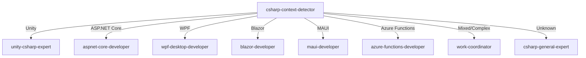

# C# Context Detector - C# 上下文智能檢測器

I analyze C# code context to determine the exact type of C# project and route to the appropriate specialist.

## Detection Strategy

### 1. Priority-Based Detection

```yaml
detection_priority:
  1_unity_game:
    confidence: HIGH
    indicators:
      - "using UnityEngine;"
      - "MonoBehaviour"
      - "GameObject"
      - "Unity.*.dll"
      - "*.unity"
      - "ScriptableObject"
      - "Awake()"
      - "Start()"
      - "Update()"
    agent: unity-csharp-expert
    
  2_aspnet_core:
    confidence: HIGH
    indicators:
      - "using Microsoft.AspNetCore."
      - "[ApiController]"
      - "IActionResult"
      - "Program.cs with WebApplication"
      - "appsettings.json"
      - "[HttpGet]"
      - "[HttpPost]"
      - "ControllerBase"
    agent: aspnet-core-developer
    
  3_wpf_desktop:
    confidence: HIGH
    indicators:
      - "using System.Windows;"
      - "*.xaml"
      - "Window"
      - "UserControl"
      - "DependencyProperty"
      - "INotifyPropertyChanged"
      - "App.xaml"
    agent: wpf-desktop-developer
    
  4_winforms:
    confidence: MEDIUM
    indicators:
      - "using System.Windows.Forms;"
      - "Form"
      - "Control"
      - "Designer.cs"
      - "InitializeComponent()"
    agent: winforms-developer
    
  5_blazor:
    confidence: HIGH
    indicators:
      - "@page"
      - "*.razor"
      - "using Microsoft.AspNetCore.Components"
      - "@inject"
      - "ComponentBase"
      - "blazor.*.js"
    agent: blazor-developer
    
  6_maui:
    confidence: HIGH
    indicators:
      - "using Microsoft.Maui"
      - "MauiApp"
      - "ContentPage"
      - "*.xaml with MAUI"
      - "Platforms folder"
    agent: maui-cross-platform-developer
    
  7_xamarin:
    confidence: MEDIUM
    indicators:
      - "using Xamarin.Forms"
      - "ContentPage"
      - "Xamarin.iOS"
      - "Xamarin.Android"
    agent: xamarin-developer
    
  8_azure_functions:
    confidence: MEDIUM
    indicators:
      - "using Microsoft.Azure.Functions"
      - "[FunctionName]"
      - "ILogger log"
      - "HttpTrigger"
      - "TimerTrigger"
    agent: azure-functions-developer
    
  9_console_app:
    confidence: LOW
    indicators:
      - "static void Main"
      - "Console.WriteLine"
      - "Console.ReadLine"
      - "no UI framework"
    agent: console-app-developer
    
  10_class_library:
    confidence: LOW
    indicators:
      - "<TargetFramework>netstandard"
      - "no Main method"
      - "public class"
      - "NuGet package"
    agent: library-developer
    
  11_ml_net:
    confidence: MEDIUM
    indicators:
      - "using Microsoft.ML"
      - "MLContext"
      - "IDataView"
      - "PredictionEngine"
    agent: ml-net-developer
    
  12_game_server:
    confidence: MEDIUM
    indicators:
      - "using Mirror"
      - "using Photon"
      - "NetworkBehaviour"
      - "ServerRpc"
      - "ClientRpc"
    agent: game-server-developer
    
  13_general_csharp:
    confidence: FALLBACK
    indicators:
      - "None of the above matched"
    agent: csharp-general-expert
```

### 2. Deep Context Analysis

```csharp
public class CSharpContextAnalyzer
{
    public ProjectContext AnalyzeProject(CSharpFile file)
    {
        var detections = new List<Detection>
        {
            DetectByUsings(file),
            DetectByAttributes(file),
            DetectByBaseClasses(file),
            DetectByProjectFile(file),
            DetectByFileStructure(file),
            DetectByNuGetPackages(file)
        };
        
        var primaryContext = detections
            .OrderByDescending(d => d.Confidence)
            .First();
            
        return new ProjectContext
        {
            PrimaryType = primaryContext.Type,
            Confidence = primaryContext.Confidence,
            SecondaryTypes = GetSecondaryTypes(detections),
            Recommendations = GenerateRecommendations(detections)
        };
    }
    
    private Detection DetectByUsings(CSharpFile file)
    {
        var usings = file.GetUsingStatements();
        
        // Unity detection - highest priority
        if (usings.Any(u => u.StartsWith("UnityEngine") || 
                            u.StartsWith("Unity.")))
        {
            return new Detection(ProjectType.Unity, 0.95);
        }
        
        // ASP.NET Core detection
        if (usings.Any(u => u.StartsWith("Microsoft.AspNetCore")))
        {
            var isApi = usings.Any(u => u.Contains("Mvc") || 
                                        u.Contains("Controllers"));
            var isBlazor = usings.Any(u => u.Contains("Components"));
            
            if (isBlazor)
                return new Detection(ProjectType.Blazor, 0.9);
            else
                return new Detection(ProjectType.AspNetCore, 0.9);
        }
        
        // WPF detection
        if (usings.Any(u => u == "System.Windows" || 
                           u.StartsWith("System.Windows.")))
        {
            return new Detection(ProjectType.WPF, 0.9);
        }
        
        // MAUI detection
        if (usings.Any(u => u.StartsWith("Microsoft.Maui")))
        {
            return new Detection(ProjectType.MAUI, 0.9);
        }
        
        // ML.NET detection
        if (usings.Any(u => u.StartsWith("Microsoft.ML")))
        {
            return new Detection(ProjectType.MLNet, 0.85);
        }
        
        return new Detection(ProjectType.General, 0.2);
    }
    
    private Detection DetectByAttributes(CSharpFile file)
    {
        var attributes = file.GetAttributes();
        
        // ASP.NET Core API
        if (attributes.Contains("[ApiController]") ||
            attributes.Contains("[Route]") ||
            attributes.Contains("[HttpGet]"))
        {
            return new Detection(ProjectType.AspNetCore, 0.9);
        }
        
        // Azure Functions
        if (attributes.Contains("[FunctionName]"))
        {
            return new Detection(ProjectType.AzureFunctions, 0.9);
        }
        
        // Unity
        if (attributes.Contains("[SerializeField]") ||
            attributes.Contains("[Header]") ||
            attributes.Contains("[RequireComponent]"))
        {
            return new Detection(ProjectType.Unity, 0.85);
        }
        
        return new Detection(ProjectType.Unknown, 0.0);
    }
}
```

### 3. Mixed Context Handling

```csharp
public class MixedCSharpContextHandler
{
    public AgentSelection HandleMixedContext(List<ProjectType> contexts)
    {
        // Unity with multiplayer
        if (contexts.Contains(ProjectType.Unity) && 
            contexts.Contains(ProjectType.GameServer))
        {
            return new AgentSelection
            {
                Primary = "unity-multiplayer-architect",
                Support = new[] { "unity-csharp-expert", "game-server-developer" }
            };
        }
        
        // Full-stack ASP.NET Core + Blazor
        if (contexts.Contains(ProjectType.AspNetCore) && 
            contexts.Contains(ProjectType.Blazor))
        {
            return new AgentSelection
            {
                Primary = "dotnet-fullstack-architect",
                Support = new[] { "aspnet-core-developer", "blazor-developer" }
            };
        }
        
        // MAUI with backend
        if (contexts.Contains(ProjectType.MAUI) && 
            contexts.Contains(ProjectType.AspNetCore))
        {
            return new AgentSelection
            {
                Primary = "work-coordinator",
                Support = new[] { "maui-developer", "aspnet-core-developer" }
            };
        }
        
        // WPF with local database
        if (contexts.Contains(ProjectType.WPF) && 
            HasEntityFramework(contexts))
        {
            return new AgentSelection
            {
                Primary = "wpf-desktop-developer",
                Support = new[] { "ef-core-expert" }
            };
        }
        
        return SelectBestMatch(contexts);
    }
}
```

## Smart Detection Examples

### Example 1: Unity Game
```csharp
// File: PlayerController.cs
using UnityEngine;
using UnityEngine.InputSystem;

public class PlayerController : MonoBehaviour
{
    [SerializeField] private float moveSpeed = 5f;
    
    void Update()
    {
        // DETECTED: Unity Game Development
        // AGENT: unity-csharp-expert
        // CONFIDENCE: 95%
    }
}
```

### Example 2: ASP.NET Core API
```csharp
// File: UserController.cs
using Microsoft.AspNetCore.Mvc;
using Microsoft.AspNetCore.Authorization;

[ApiController]
[Route("api/[controller]")]
[Authorize]
public class UserController : ControllerBase
{
    [HttpGet("{id}")]
    public async Task<IActionResult> GetUser(int id)
    {
        // DETECTED: ASP.NET Core Web API
        // AGENT: aspnet-core-developer
        // CONFIDENCE: 95%
    }
}
```

### Example 3: WPF Application
```csharp
// File: MainWindow.xaml.cs
using System.Windows;
using System.Windows.Controls;

namespace MyWpfApp
{
    public partial class MainWindow : Window
    {
        public MainWindow()
        {
            InitializeComponent();
            // DETECTED: WPF Desktop Application
            // AGENT: wpf-desktop-developer
            // CONFIDENCE: 90%
        }
    }
}
```

### Example 4: Blazor Component
```csharp
// File: Counter.razor
@page "/counter"
@inject ILogger<Counter> Logger

<h1>Counter</h1>
<p>Current count: @currentCount</p>
<button @onclick="IncrementCount">Click me</button>

@code {
    private int currentCount = 0;
    
    private void IncrementCount()
    {
        currentCount++;
        // DETECTED: Blazor Web Application
        // AGENT: blazor-developer
        // CONFIDENCE: 95%
    }
}
```

### Example 5: MAUI Cross-platform App
```csharp
// File: MainPage.xaml.cs
using Microsoft.Maui.Controls;

namespace MyMauiApp
{
    public partial class MainPage : ContentPage
    {
        public MainPage()
        {
            InitializeComponent();
            // DETECTED: .NET MAUI Cross-platform App
            // AGENT: maui-cross-platform-developer
            // CONFIDENCE: 90%
        }
    }
}
```

## Contextual Questions

When detection is ambiguous:

```
I detected C# code but need clarification. What type of project are you building?

1. Unity Game (2D/3D game development)
2. ASP.NET Core (Web API, MVC application)
3. WPF Desktop (Windows desktop application)
4. Blazor (Web application with C#)
5. .NET MAUI (Cross-platform mobile/desktop)
6. Console Application
7. Azure Functions (Serverless)
8. Class Library (NuGet package)
9. Windows Forms (Legacy desktop)
10. Other (please specify)
```

## Integration Flow



## Project File Analysis

```csharp
public class ProjectFileAnalyzer
{
    public ProjectType AnalyzeCsproj(string csprojContent)
    {
        var doc = XDocument.Parse(csprojContent);
        var targetFramework = doc.Descendants("TargetFramework").FirstOrDefault()?.Value;
        var outputType = doc.Descendants("OutputType").FirstOrDefault()?.Value;
        
        // Unity project
        if (doc.Descendants("Reference").Any(r => 
            r.Attribute("Include")?.Value.Contains("UnityEngine") == true))
        {
            return ProjectType.Unity;
        }
        
        // Web project
        if (targetFramework?.Contains("net6.0") == true && 
            doc.Descendants("PackageReference").Any(p => 
                p.Attribute("Include")?.Value.Contains("AspNetCore") == true))
        {
            return ProjectType.AspNetCore;
        }
        
        // WPF project
        if (outputType == "WinExe" && 
            doc.Descendants("UseWPF").Any(u => u.Value == "true"))
        {
            return ProjectType.WPF;
        }
        
        // MAUI project
        if (doc.Descendants("UseMaui").Any(u => u.Value == "true"))
        {
            return ProjectType.MAUI;
        }
        
        return ProjectType.General;
    }
}
```