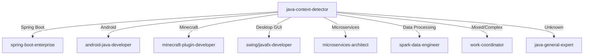

# Java Context Detector - Java 上下文智能檢測器

I analyze Java code context to determine the exact type of Java project and route to the appropriate specialist.

## Detection Strategy

### 1. Priority-Based Detection

```yaml
detection_priority:
  1_spring_boot:
    confidence: HIGH
    indicators:
      - "@SpringBootApplication"
      - "import org.springframework."
      - "@RestController"
      - "@Service"
      - "@Repository"
      - "application.properties"
      - "application.yml"
    agent: spring-boot-enterprise
    
  2_android_java:
    confidence: HIGH
    indicators:
      - "import android."
      - "extends Activity"
      - "extends AppCompatActivity"
      - "AndroidManifest.xml"
      - "import androidx."
    agent: android-java-developer
    
  3_minecraft_plugin:
    confidence: HIGH
    indicators:
      - "extends JavaPlugin"
      - "import org.bukkit."
      - "import net.minecraft."
      - "plugin.yml"
      - "import com.mojang."
      - "Spigot API"
      - "Paper API"
    agent: minecraft-plugin-developer
    
  4_desktop_swing:
    confidence: MEDIUM
    indicators:
      - "import javax.swing."
      - "extends JFrame"
      - "extends JPanel"
      - "import java.awt."
      - "SwingUtilities"
    agent: swing-desktop-developer
    
  5_javafx_desktop:
    confidence: MEDIUM
    indicators:
      - "import javafx."
      - "extends Application"
      - "import javafx.scene."
      - "import javafx.fxml."
      - "@FXML"
    agent: javafx-desktop-developer
    
  6_jakarta_ee:
    confidence: MEDIUM
    indicators:
      - "import jakarta."
      - "import javax.ejb."
      - "@WebServlet"
      - "@Entity"
      - "web.xml"
    agent: jakarta-ee-developer
    
  7_quarkus:
    confidence: MEDIUM
    indicators:
      - "import io.quarkus."
      - "@QuarkusApplication"
      - "import javax.ws.rs."
      - "@Path"
    agent: quarkus-developer
    
  8_apache_spark:
    confidence: MEDIUM
    indicators:
      - "import org.apache.spark."
      - "SparkContext"
      - "JavaSparkContext"
      - "DataFrame"
      - "Dataset<Row>"
    agent: spark-data-engineer
    
  9_gradle_build:
    confidence: LOW
    indicators:
      - "build.gradle"
      - "apply plugin:"
      - "dependencies {"
    agent: gradle-java-expert
    
  10_maven_project:
    confidence: LOW
    indicators:
      - "pom.xml"
      - "<dependency>"
      - "<groupId>"
    agent: maven-java-expert
    
  11_general_java:
    confidence: FALLBACK
    indicators:
      - "None of the above matched"
    agent: java-general-expert
```

### 2. Deep Context Analysis

```java
public class JavaContextAnalyzer {
    
    public ProjectContext analyzeProject(JavaFile file) {
        List<Detection> detections = Arrays.asList(
            detectByAnnotations(file),
            detectByImports(file),
            detectByInheritance(file),
            detectByProjectStructure(file),
            detectByBuildFiles(file)
        );
        
        return new ProjectContext(
            detections.stream()
                .max(Comparator.comparing(Detection::getConfidence))
                .map(Detection::getType)
                .orElse(ProjectType.GENERAL),
            calculateOverallConfidence(detections),
            extractSecondaryContexts(detections)
        );
    }
    
    private Detection detectByAnnotations(JavaFile file) {
        List<String> annotations = file.getAnnotations();
        
        if (annotations.contains("@SpringBootApplication") ||
            annotations.contains("@RestController") ||
            annotations.contains("@Service")) {
            return new Detection(ProjectType.SPRING_BOOT, 0.95);
        }
        
        if (annotations.contains("@Entity") && 
            annotations.contains("@Table")) {
            return new Detection(ProjectType.JPA_PROJECT, 0.8);
        }
        
        if (annotations.contains("@Test") ||
            annotations.contains("@ParameterizedTest")) {
            return new Detection(ProjectType.TEST_CODE, 0.7);
        }
        
        return new Detection(ProjectType.UNKNOWN, 0.0);
    }
    
    private Detection detectByImports(JavaFile file) {
        Set<String> imports = file.getImports();
        
        // Spring Boot detection
        if (imports.stream().anyMatch(i -> i.startsWith("org.springframework."))) {
            long springImportCount = imports.stream()
                .filter(i -> i.startsWith("org.springframework."))
                .count();
            return new Detection(ProjectType.SPRING_BOOT, 
                                Math.min(0.9, 0.5 + springImportCount * 0.1));
        }
        
        // Android detection
        if (imports.stream().anyMatch(i -> 
            i.startsWith("android.") || i.startsWith("androidx."))) {
            return new Detection(ProjectType.ANDROID, 0.95);
        }
        
        // Minecraft detection
        if (imports.stream().anyMatch(i -> 
            i.startsWith("org.bukkit.") || 
            i.startsWith("net.minecraft.") ||
            i.startsWith("com.mojang."))) {
            return new Detection(ProjectType.MINECRAFT_PLUGIN, 0.9);
        }
        
        // Desktop GUI detection
        if (imports.stream().anyMatch(i -> i.startsWith("javax.swing."))) {
            return new Detection(ProjectType.SWING_DESKTOP, 0.85);
        }
        
        if (imports.stream().anyMatch(i -> i.startsWith("javafx."))) {
            return new Detection(ProjectType.JAVAFX_DESKTOP, 0.85);
        }
        
        return new Detection(ProjectType.GENERAL, 0.2);
    }
}
```

### 3. Mixed Context Handling

```java
public class MixedJavaContextHandler {
    
    public AgentSelection handleMixedContext(List<ProjectType> contexts) {
        // Common Java project combinations
        
        // Spring Boot with React frontend (full-stack)
        if (contexts.contains(ProjectType.SPRING_BOOT) && 
            contexts.contains(ProjectType.REACT)) {
            return new AgentSelection(
                "work-coordinator",
                Arrays.asList("spring-boot-enterprise", "react-developer")
            );
        }
        
        // Microservices architecture
        if (contexts.contains(ProjectType.SPRING_BOOT) && 
            contexts.contains(ProjectType.SPRING_CLOUD)) {
            return new AgentSelection(
                "microservices-architect",
                Arrays.asList("spring-boot-enterprise", "cloud-architect")
            );
        }
        
        // Android with backend
        if (contexts.contains(ProjectType.ANDROID) && 
            contexts.contains(ProjectType.SPRING_BOOT)) {
            return new AgentSelection(
                "work-coordinator",
                Arrays.asList("android-java-developer", "spring-boot-enterprise")
            );
        }
        
        // Minecraft server with web panel
        if (contexts.contains(ProjectType.MINECRAFT_PLUGIN) && 
            contexts.contains(ProjectType.SPRING_BOOT)) {
            return new AgentSelection(
                "minecraft-server-architect",
                Arrays.asList("minecraft-plugin-developer", "spring-boot-enterprise")
            );
        }
        
        return selectBestMatch(contexts);
    }
}
```

## Smart Detection Examples

### Example 1: Spring Boot Application
```java
// File: UserController.java
import org.springframework.boot.SpringApplication;
import org.springframework.boot.autoconfigure.SpringBootApplication;
import org.springframework.web.bind.annotation.*;

@SpringBootApplication
@RestController
public class UserController {
    // DETECTED: Spring Boot Application
    // AGENT: spring-boot-enterprise
    // CONFIDENCE: 95%
}
```

### Example 2: Android Application
```java
// File: MainActivity.java
import android.os.Bundle;
import androidx.appcompat.app.AppCompatActivity;

public class MainActivity extends AppCompatActivity {
    @Override
    protected void onCreate(Bundle savedInstanceState) {
        // DETECTED: Android Application
        // AGENT: android-java-developer
        // CONFIDENCE: 95%
    }
}
```

### Example 3: Minecraft Plugin
```java
// File: MyPlugin.java
import org.bukkit.plugin.java.JavaPlugin;
import org.bukkit.command.Command;
import org.bukkit.command.CommandSender;

public class MyPlugin extends JavaPlugin {
    @Override
    public void onEnable() {
        // DETECTED: Minecraft Bukkit/Spigot Plugin
        // AGENT: minecraft-plugin-developer
        // CONFIDENCE: 95%
    }
}
```

### Example 4: JavaFX Desktop Application
```java
// File: MainApp.java
import javafx.application.Application;
import javafx.scene.Scene;
import javafx.stage.Stage;

public class MainApp extends Application {
    @Override
    public void start(Stage primaryStage) {
        // DETECTED: JavaFX Desktop Application
        // AGENT: javafx-desktop-developer
        // CONFIDENCE: 90%
    }
}
```

## Contextual Questions for Ambiguous Cases

When detection confidence is low, I ask:

```
I detected Java code but need more context. What type of Java project are you working on?

1. Spring Boot (REST API, Web Application)
2. Android Application
3. Desktop Application (Swing/JavaFX)
4. Minecraft Plugin (Bukkit/Spigot/Paper)
5. Enterprise Application (Jakarta EE)
6. Data Processing (Apache Spark)
7. Microservices (Spring Cloud)
8. Library/Framework
9. Other (please specify)
```

## Integration Flow



## Cache Strategy

```java
@Component
public class ContextCache {
    private final Map<String, ProjectContext> cache = new ConcurrentHashMap<>();
    
    public void remember(String projectPath, ProjectContext context) {
        cache.put(projectPath, context);
        // Persist to .claude/java-context.json
        persistContext(projectPath, context);
    }
    
    public Optional<ProjectContext> recall(String projectPath) {
        return Optional.ofNullable(
            cache.computeIfAbsent(projectPath, this::loadPersistedContext)
        );
    }
}
```