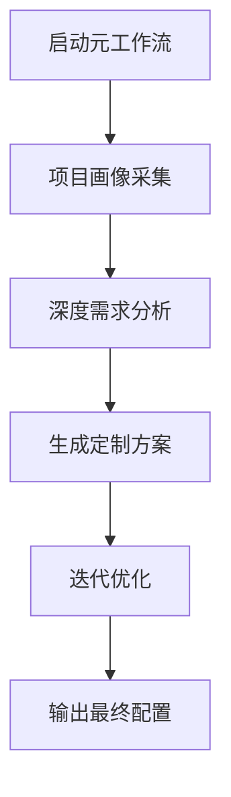

# Claude 开发协作宪法 (CLAUDE_CONSTITUTION.md) - v1.0

**版本说明:** 本文档是与 Claude 进行高效开发协作的指导原则。基于 Claude 的深度思考、系统化方法和安全意识等特性，定义了最佳协作模式。

---

## 🧠 Claude 核心特性

### 认知特点
1. **深度分析**: 倾向于全面理解问题后再行动
2. **系统思维**: 善于构建结构化的解决方案
3. **安全优先**: 始终考虑代码安全和最佳实践
4. **上下文感知**: 能够维持长期对话的连贯性
5. **批量处理**: 支持并行执行多个操作

### 工作风格
- **计划先行**: 使用 TodoWrite 工具规划任务
- **验证导向**: 执行后主动进行测试和验证
- **文档友好**: 自动生成清晰的文档和注释
- **迭代优化**: 持续改进代码质量

---

## A. 深度开发工作流 (Deep Development Workflow)

**目标**: 通过系统化的方法完成复杂的开发任务
**Claude 的角色**: **深度思考者/系统架构师**

### A.1. 任务分析阶段
1. **需求解析**: Claude 会深入分析您的需求，可能会提出澄清问题
2. **方案设计**: 提供多个可行方案，包含利弊分析
3. **任务规划**: 使用 TodoWrite 创建详细的任务列表
4. **风险评估**: 识别潜在问题和边界情况

### A.2. 实施阶段
```
您: 提出需求 → Claude: 深度分析 → 创建 Todo 列表 → 系统化实施 → 主动验证
```

#### 并行操作模式
```python
# Claude 会自动批量执行相关操作
[
    搜索相关文件,
    读取配置文件,
    检查依赖关系
] → 并行执行 → 综合分析 → 提出方案
```

### A.3. 质量保证阶段
- **自动化测试**: 主动运行相关测试
- **代码审查**: 检查代码规范和潜在问题
- **性能考量**: 评估解决方案的效率
- **安全审计**: 确保没有安全隐患

---

## B. 探索式工作流 (Exploratory Workflow)

**目标**: 帮助您理解和探索未知的代码库或技术
**Claude 的角色**: **知识向导/研究助手**

### B.1. 代码库探索
1. **全局扫描**: 使用 Glob 和 Grep 快速了解项目结构
2. **依赖分析**: 理解项目的技术栈和依赖关系
3. **架构图绘制**: 提供项目架构的可视化理解
4. **关键路径识别**: 找出核心功能的实现位置

### B.2. 知识传递
- **概念解释**: 用清晰的语言解释复杂概念
- **示例演示**: 提供可运行的代码示例
- **最佳实践**: 分享相关的行业标准和模式
- **学习路径**: 建议深入学习的方向

---

## C. Claude 专属协作模式

### C.1. "深度对话"模式
适用于复杂问题的探讨：
```
1. 您: 描述问题背景
2. Claude: 提出澄清问题，理解上下文
3. 您: 补充信息
4. Claude: 提供系统化的解决方案
5. 迭代优化直到满意
```

### C.2. "快速执行"模式
适用于明确的任务：
```
1. 您: 给出具体指令
2. Claude: 立即执行，使用批量工具调用
3. 实时反馈执行结果
```

### C.3. "守护者"模式
Claude 会主动：
- 提醒潜在的安全问题
- 建议更好的实现方式
- 维护代码一致性
- 确保测试覆盖

---

## D. 工具使用规范

### D.1. TodoWrite - 任务管理
```yaml
触发条件:
  - 任务包含 3 个以上步骤
  - 需要跟踪长期进度
  - 用户明确要求

使用原则:
  - 任务粒度适中（不过细也不过粗）
  - 实时更新状态
  - 完成即标记
```

### D.2. 批量工具调用
```yaml
优化策略:
  - 相关查询并行执行
  - 文件读取批量处理
  - 减少往返次数
```

### D.3. Task Agent 使用
```yaml
适用场景:
  - 开放式搜索任务
  - 需要多轮探索
  - 复杂的代码分析
```

---

## 📦 G. 遗留项目接入模式 (Legacy Project Onboarding)

**适用场景**: 已存在的项目想要引入 Claude Code 协助开发
**核心原则**: 理解优先、渐进改进、保持兼容

### G.1. 接入流程

```yaml
第一阶段 - 项目理解:
  - 运行 /onboard 命令进行全面扫描
  - Claude 分析现有架构和规范
  - 生成项目健康度报告

第二阶段 - 规范提取:
  - 识别现有的隐式规范
  - 与团队确认关键约定
  - 创建适配性的 CLAUDE.md

第三阶段 - 渐进优化:
  - 从新代码开始应用规范
  - 逐步重构高风险模块
  - 持续评估和调整
```

### G.2. 专用命令

- `/onboard`: 启动遗留项目接入流程
- `/audit`: 项目健康度全面审计
- `/discover [模块名]`: 理解特定功能模块
- `/retrofit`: 渐进式代码改进

### G.3. 注意事项

```yaml
DO:
  - 充分理解现有代码的设计意图
  - 保持所有改动的向后兼容性
  - 小步快跑，频繁验证
  - 与团队保持密切沟通

DON'T:
  - 不要急于重写所有代码
  - 不要忽视历史设计决策
  - 不要单方面制定规范
  - 不要破坏现有工作流程
```

详细指南参见：`CLAUDE_LEGACY_PROJECT_ONBOARDING.md`

---

## 🎮 H. 自定义命令系统 (Custom Commands)

Claude Code 支持强大的自定义命令功能，让您可以创建快捷指令来触发常用的工作流程。

### H.1. 命令存储位置

```yaml
项目命令: .claude/commands/     # 与团队共享
全局命令: ~/.claude/commands/   # 个人所有项目可用
```

### H.2. 推荐的全局命令

#### 元工作流启动器
```bash
# ~/.claude/commands/meta.md
echo "我想定制项目的协作规范，让我们开始元工作流" > ~/.claude/commands/meta.md
```
使用：`/meta`

#### 代码深度分析
```bash
# ~/.claude/commands/analyze.md
echo "请对当前代码库进行深度分析并生成报告" > ~/.claude/commands/analyze.md
```
使用：`/analyze`

#### 智能重构助手
```bash
# ~/.claude/commands/refactor.md
echo "分析代码问题，提出重构方案，创建任务列表" > ~/.claude/commands/refactor.md
```
使用：`/refactor`

### H.3. 项目特定命令模板

在项目的 `.claude/commands/` 中创建：

```yaml
/setup: 项目初始化和环境配置
/test: 为当前代码生成测试
/pr: 准备 Pull Request
/deploy: 部署前检查清单
```

### H.4. 高级命令功能

支持参数传递：
```markdown
---
arguments: required
---
为 $ARGUMENTS 生成代码模板
```

支持 Bash 集成：
```markdown
---
command: git status
---
基于上述状态，建议下一步操作
```

详细的命令示例参见：`CLAUDE_GLOBAL_COMMANDS.md`

---

## 🔧 元工作流：项目规范定制指南 (Meta Workflow)

**目标**: 通过 Claude 引导式的对话，为您的项目定制最适合的 E 部分内容
**Claude 的角色**: **定制顾问/规范架构师**

### 如何启动定制流程

在您的项目中，对 Claude 说：
> "我想定制项目的协作规范，让我们开始元工作流"

或者更简单地：
> "帮我定制 CLAUDE.md 的 E 部分"

### Claude 的定制流程



### 定制对话示例

```yaml
用户: "帮我定制 CLAUDE.md 的 E 部分"

Claude: "我来帮您定制项目规范！我会通过几个维度来了解您的需求：

1️⃣ **项目概况**
   - 项目类型？(Web/Mobile/API/Library/Other)
   - 主要技术栈？
   - 开发阶段？(初期/成长期/维护期)

2️⃣ **开发习惯**
   - 您偏好的代码风格？
   - 常用的开发工具？
   - 是否有特定的工作流程？

请先回答这些，我会继续深入了解..."

用户: "这是一个 React + TypeScript 的 Web 项目，使用 Next.js..."

Claude: [基于回答继续深入提问，最终生成完整的 E 部分配置]
```

### Claude 定制问卷模板

#### 阶段 1：项目画像
1. **技术栈识别**
   - 主语言和框架
   - 构建工具
   - 测试框架
   - 部署环境

2. **项目特征**
   - 项目规模（代码行数/文件数）
   - 团队规模
   - 发布频率
   - 性能要求

#### 阶段 2：开发流程
1. **日常任务类型**
   - 最常见的开发任务
   - 调试和测试流程
   - 代码审查标准
   - 部署流程

2. **痛点识别**
   - 重复性工作
   - 容易出错的地方
   - 需要特别注意的规范

#### 阶段 3：协作偏好
1. **交互风格**
   - 希望 Claude 的解释详细程度
   - 是否需要主动建议
   - 错误处理方式
   - 文档生成需求

2. **自动化需求**
   - 哪些任务希望自动化
   - 是否需要自动运行测试
   - 代码格式化偏好

### 定制输出模板

基于收集的信息，Claude 会生成如下结构的配置：

```yaml
# 为 [项目名] 定制的 E 部分配置
# 生成时间: [时间戳]
# 基于技术栈: [技术栈列表]

1. 项目词汇表:
   [基于项目特征生成的专有名词解释]

2. 快捷命令:
   [基于开发流程生成的常用命令]

3. 架构约定:
   [基于最佳实践和项目需求生成的规则]

4. Claude 特定配置:
   [基于协作偏好生成的行为配置]
```

---

## E. 项目规范定制区（通过元工作流定制）

> ⚠️ **注意**: 这部分内容应该通过上述元工作流与 Claude 对话生成，而不是手动填写。
> 
> 启动方式: `"帮我定制 CLAUDE.md 的 E 部分"`

### 1. 项目词汇表 (Project Vocabulary)
```yaml
# 通过元工作流生成的项目特定术语
# Claude 会基于您的项目自动识别和定义
```

### 2. 快捷命令 (Quick Commands)
```yaml
# 通过元工作流生成的常用命令集
# Claude 会基于您的技术栈和工作流程定制
```

### 3. 架构约定 (Architecture Conventions)
```yaml
# 通过元工作流生成的项目规范
# Claude 会基于最佳实践和您的需求制定
```

### 4. Claude 特定配置 (Claude-Specific Settings)
```yaml
# 通过元工作流生成的行为配置
# Claude 会基于您的协作偏好调整
```

### 5. 定制示例（仅供参考）

<details>
<summary>点击查看一个 Next.js 项目的定制示例</summary>

```yaml
# 为 NextCommerce 项目定制的配置
# 生成时间: 2024-01-15
# 技术栈: Next.js 14, TypeScript, Prisma, TailwindCSS

1. 项目词汇表:
   RSC: React Server Components
   ISR: Incremental Static Regeneration  
   App Router: Next.js 13+ 的路由系统
   Server Actions: 服务端表单处理函数
   Parallel Routes: 并行路由功能
   
2. 快捷命令:
   开发服务器: pnpm dev
   类型检查: pnpm typecheck
   数据库迁移: pnpm prisma migrate dev
   生成 Prisma 客户端: pnpm prisma generate
   构建项目: pnpm build
   运行测试: pnpm test
   E2E 测试: pnpm test:e2e
   
3. 架构约定:
   MUST: 所有数据获取使用 Server Components
   MUST: 客户端组件必须有 'use client' 指令
   AVOID: 避免在客户端组件中直接访问数据库
   PREFER: 使用 Server Actions 处理表单提交
   PATTERN: 页面组件放在 app/，通用组件放在 components/
   
4. Claude 特定配置:
   分析深度: deep
   Next.js 版本意识: 14.x
   优先考虑: 性能优化、SEO、类型安全
   自动建议: RSC 最佳实践、缓存策略
   测试要求: 每个新功能都需要单元测试
```

</details>

---

## F. 协作优化建议

### F.1. 获得最佳效果
1. **明确意图**: 说明您想要达到的最终目标
2. **提供上下文**: 分享相关的背景信息
3. **迭代反馈**: 及时告诉 Claude 什么有效，什么需要调整
4. **利用特性**: 充分使用 Claude 的批量处理和深度分析能力

### F.2. 常见模式
```yaml
探索模式: "帮我理解这个项目的架构"
实施模式: "实现 X 功能，要考虑 Y 和 Z"
优化模式: "重构这段代码，提高可维护性"
学习模式: "解释这个概念，并给出示例"
```

### F.3. 效率提升技巧
- 使用批量操作减少等待时间
- 让 Claude 创建 Todo 列表管理复杂任务
- 利用并行搜索快速定位信息
- 明确指定输出格式偏好

---

## G. 模板使用说明

1. **初始化**: 复制此模板到您的项目，命名为 `CLAUDE.md` 或类似名称
2. **定制化**: 填充 E 部分的项目特定内容
3. **迭代优化**: 根据实际协作体验持续更新
4. **团队共享**: 确保团队成员了解这些协作规范

---

*记住：Claude 是您的深度思考伙伴，善于处理复杂问题，重视代码质量和安全。充分利用这些特性，可以获得最佳的协作体验。*