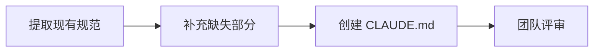
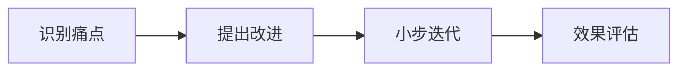

# Claude Code 遗留项目接入指南

本指南专门为已存在的项目设计，帮助您将 Claude Code 平滑地集成到现有开发流程中。

## 🎯 核心理念

与新项目不同，遗留项目需要：
1. **先理解，后规范** - 先深入理解现有架构和约定
2. **渐进式接入** - 不要一次性改变所有流程
3. **保持兼容** - 尊重现有的团队习惯和规范
4. **技术债务感知** - 识别并记录技术债务

## 📋 接入流程

### 第一阶段：项目理解（1-2天）


### 第二阶段：规范建立（2-3天）



### 第三阶段：逐步优化（持续）



## 🎮 专用命令集

### 1. `/onboard` - 遗留项目接入向导
**文件**: `~/.claude/commands/onboard.md`
```markdown
我需要接入一个现有项目。请执行以下步骤：

1. **项目扫描**
   - 识别技术栈和框架版本
   - 分析目录结构
   - 检测构建和测试配置

2. **代码分析**
   - 统计代码规模
   - 识别核心模块
   - 发现编码模式

3. **规范提取**
   - 分析现有的代码风格
   - 识别命名约定
   - 提取架构模式

4. **生成初始 CLAUDE.md**
   - 基于发现的规范
   - 标记需要确认的部分
   - 保留改进建议
```

### 2. `/audit` - 项目健康度审计
**文件**: `~/.claude/commands/audit.md`
```markdown
---
command: |
  echo "=== 项目基础信息 ==="
  find . -name "*.js" -o -name "*.ts" -o -name "*.py" -o -name "*.go" | wc -l
  echo "源文件总数"
---
对这个项目进行全面审计：

1. **代码质量**
   - 识别代码异味
   - 检查重复代码
   - 评估测试覆盖率

2. **架构健康度**
   - 模块耦合度
   - 依赖关系
   - 技术债务

3. **安全风险**
   - 过时的依赖
   - 潜在漏洞
   - 配置问题

生成详细的审计报告。
```

### 3. `/discover` - 渐进式发现
**文件**: `~/.claude/commands/discover.md`
```markdown
---
arguments: optional
---
帮我理解这个项目的 ${ARGUMENTS:-核心功能}：

1. 找到相关的入口点
2. 追踪执行流程
3. 识别关键组件
4. 解释业务逻辑
5. 画出流程图

注：这是一个遗留项目，请特别注意：
- 可能存在的隐式约定
- 未文档化的业务规则
- 历史遗留的设计决策
```

### 4. `/retrofit` - 规范改造助手
**文件**: `~/.claude/commands/retrofit.md`
```markdown
我想逐步改进这个遗留项目的代码质量。请：

1. 识别一个小的、独立的模块
2. 分析其当前问题
3. 提出改进方案（保持向后兼容）
4. 创建重构任务列表
5. 估算影响范围

原则：小步快跑，持续改进
```

## 📝 遗留项目专用元工作流

### 启动对话示例

```yaml
用户: /onboard

Claude: 我来帮您接入这个现有项目。让我先进行初步扫描...

[执行项目分析]

基于初步扫描，我发现：
- 这是一个 Node.js + Express 项目
- 使用 MongoDB 作为数据库
- 代码风格：混合（部分 ES6+，部分 CommonJS）
- 测试框架：Mocha（覆盖率约 45%）

现在我需要了解一些项目背景：

1. **项目历史**
   - 项目开发了多久？
   - 团队规模如何？
   - 是否有技术文档？

2. **当前痛点**
   - 最让您困扰的是什么？
   - 哪些地方经常出bug？
   - 有哪些技术债务？

3. **改进目标**
   - 您希望 Claude 主要帮助什么？
   - 有什么不能改变的约束？
   - 期望的改进节奏？

用户: 项目开发3年了，团队5人，文档很少。主要痛点是代码不一致，经常在用户认证模块出bug。希望先统一代码风格，然后逐步重构认证模块。

Claude: 了解了。基于您的情况，我建议采用"渐进式改进"策略：

## 第一步：建立基线（本周）
1. 生成现有代码风格报告
2. 创建最小化的 CLAUDE.md
3. 设置自动化检查（不阻塞，仅警告）

## 第二步：统一新代码（下周）
1. 为新代码制定规范
2. 提供代码模板
3. 在代码审查中逐步推广

## 第三步：重构认证模块（第3-4周）
1. 先编写测试，确保行为不变
2. 逐步重构，每次一个小功能
3. 保持新旧API兼容

让我为您生成初始的 CLAUDE.md...
```

## 🔧 CLAUDE.md 模板（遗留项目版）

```markdown
# CLAUDE.md - [项目名] 遗留项目指南

## 项目概况
- **创建时间**: [时间]
- **技术栈**: [识别的技术栈]
- **代码规模**: [文件数/代码行数]
- **技术债务等级**: 高/中/低

## 现有约定（已识别）
[Claude 自动识别的现有模式]

## 渐进改进计划
1. **阶段一**: 规范新代码
2. **阶段二**: 重构高风险模块
3. **阶段三**: 全面现代化

## 特殊注意事项
- **不要改变**: [列出不能动的部分]
- **历史包袱**: [需要特别小心的地方]
- **隐式规则**: [未文档化但重要的约定]

## Claude 行为配置
改动保守度: high  # 遗留项目默认保守
兼容性检查: strict  # 严格检查向后兼容
重构建议: gradual  # 渐进式建议
```

## 💡 最佳实践

### 1. 分阶段接入
- **第1周**: 只观察和学习
- **第2周**: 开始规范新代码
- **第3-4周**: 尝试小范围重构
- **之后**: 根据效果调整策略

### 2. 风险控制
- 总是先写测试再重构
- 保持新旧 API 并存一段时间
- 每次只改一个小模块
- 充分的代码审查

### 3. 团队协作
- 让团队参与规范制定
- 定期收集反馈
- 逐步培养新习惯
- 庆祝小胜利

## 🚨 常见陷阱

1. **过于激进**: 不要试图一次性改变一切
2. **忽视历史**: 要理解为什么是现在这样
3. **破坏兼容**: 始终考虑依赖方
4. **单打独斗**: 要带动整个团队

## 📊 成功指标

- 新代码的一致性提升
- Bug 率下降
- 开发效率提升
- 团队满意度提高

---

*记住：改造遗留项目是马拉松，不是短跑。耐心和坚持是关键。*