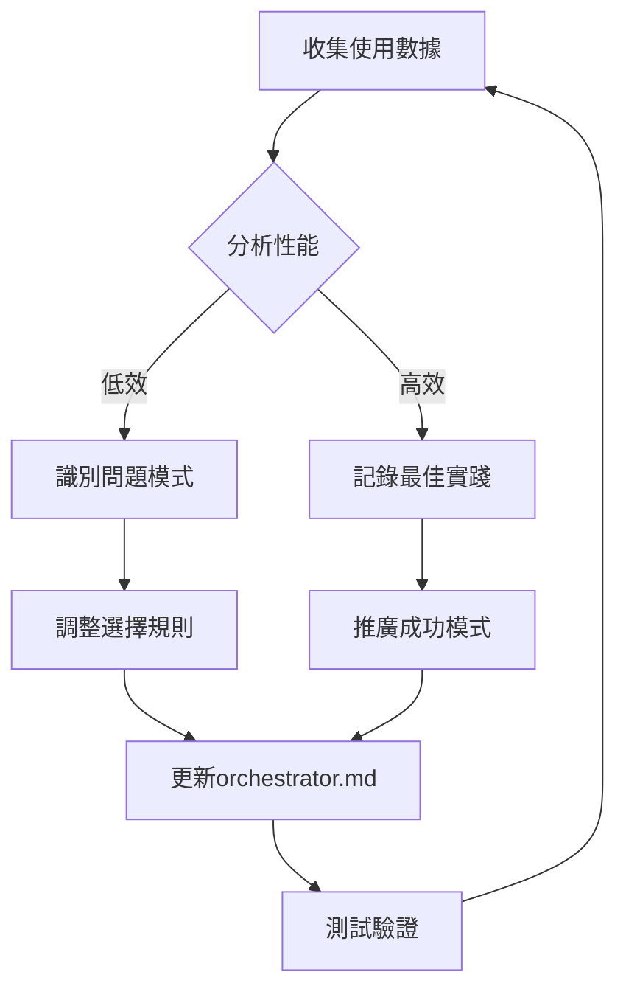

# Agent使用監控系統

## 目的
追蹤和分析agent的實際使用情況，用於持續優化選擇邏輯

## 監控指標

### 1. 使用頻率指標
```yaml
agent_frequency:
  daily_calls: 每日調用次數
  weekly_calls: 每週調用次數
  monthly_calls: 每月調用次數
  last_used: 最後使用時間
```

### 2. 性能指標
```yaml
agent_performance:
  avg_tokens_used: 平均token使用量
  max_tokens_used: 最大token使用量
  min_tokens_used: 最小token使用量
  avg_execution_time: 平均執行時間
  success_rate: 成功率
  error_rate: 錯誤率
```

### 3. 選擇準確性
```yaml
selection_accuracy:
  correct_selections: 正確選擇次數
  incorrect_selections: 錯誤選擇次數
  user_overrides: 用戶覆蓋次數
  fallback_triggers: 降級選擇次數
```

### 4. Token效率分析
```yaml
token_efficiency:
  target_budget: 目標預算
  actual_usage: 實際使用
  efficiency_rate: 效率比率 (target/actual)
  waste_percentage: 浪費百分比
```

## 監控報告模板

### 日報（Daily Report）
```markdown
# Agent使用日報 - [日期]

## 今日摘要
- 總調用次數: [N]
- 活躍agents: [M]
- 平均token使用: [X]k
- 效率評分: [Y]%

## Top 5 最常用Agents
1. [agent-name]: [calls] 次, [tokens]k tokens
2. [agent-name]: [calls] 次, [tokens]k tokens
3. [agent-name]: [calls] 次, [tokens]k tokens
4. [agent-name]: [calls] 次, [tokens]k tokens
5. [agent-name]: [calls] 次, [tokens]k tokens

## 問題與警告
- [任何超出預算的情況]
- [錯誤選擇的案例]
- [需要優化的patterns]

## 改進建議
- [基於數據的優化建議]
```

### 週報（Weekly Report）
```markdown
# Agent使用週報 - [週期]

## 趨勢分析
- 總調用趨勢: ↑/↓ [percentage]%
- Token效率趨勢: ↑/↓ [percentage]%
- 新興使用模式: [patterns]

## Agent排行榜
### 最高效率
1. [agent]: [efficiency]% 效率
2. [agent]: [efficiency]% 效率
3. [agent]: [efficiency]% 效率

### 最需優化
1. [agent]: [issue description]
2. [agent]: [issue description]
3. [agent]: [issue description]

## 選擇準確性分析
- 整體準確率: [X]%
- 改進區域: [areas]
- 建議規則調整: [rules]
```

## 實施方式

### 1. 手動記錄（當前階段）
```yaml
# .claude/monitoring/usage-log.yml
sessions:
  - date: 2025-01-26
    requests:
      - input: "Optimize React performance"
        selected_agent: performance-optimizer
        tokens_used: 95000
        success: true
        time_taken: 45s
      - input: "Build Android app"
        selected_agent: android-kotlin-architect
        tokens_used: 148000
        success: true
        time_taken: 120s
```

### 2. 分析腳本（未來自動化）
```python
# analyze_usage.py
def analyze_agent_usage(log_file):
    """分析agent使用日誌"""
    # 讀取日誌
    # 計算統計數據
    # 生成報告
    # 提出優化建議
```

## 關鍵績效指標（KPIs）

### 必須達成
- **選擇準確率**: > 95%
- **Token效率**: < 300k 平均
- **單一agent優先率**: > 80%
- **錯誤率**: < 5%

### 優化目標
- **響應時間**: < 30秒
- **用戶滿意度**: > 90%
- **無需人工干預率**: > 85%

## 警報閾值

### 🔴 紅色警報（立即處理）
- 任何agent錯誤率 > 20%
- 單次請求token > 500k
- 選擇已刪除的agent

### 🟡 黃色警報（需要關注）
- Agent錯誤率 > 10%
- Token使用超預算 > 50%
- 重複選擇衝突agents

### 🟢 正常範圍
- 錯誤率 < 5%
- Token在預算內
- 選擇符合預期

## 優化決策流程



## 持續改進計劃

### Phase 1: 建立基線（當前）
- 手動記錄關鍵使用案例
- 識別常見模式
- 建立初始KPIs

### Phase 2: 自動化收集
- 開發日誌收集工具
- 自動生成日報/週報
- 實時警報系統

### Phase 3: 智能優化
- 基於ML的選擇優化
- 預測性能問題
- 自動規則調整

## 注意事項
- 保護用戶隱私，不記錄敏感信息
- 定期清理舊日誌
- 確保監控不影響性能
- 平衡詳細度與實用性