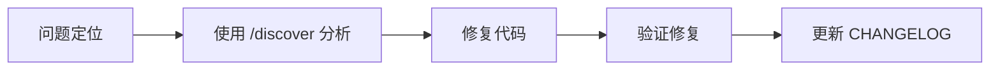

# CLAUDE.md - [项目名] AI 协作规范

<!-- 
Claude Constitution Version: 2.0.0
Generated: [生成日期]
Template: claude/templates/CLAUDE_MD_TEMPLATE.md
Last Updated: [更新日期]
Customized Sections: E
-->

本文件定义了 Claude Code 在本项目中的协作规范和工作流程。

## 📋 项目概述

**项目名称**: [项目名]
**技术栈**: [主要技术栈列表]
**项目阶段**: [初期/成长期/维护期]
**团队规模**: [人数]

## 🛠️ 技术规范

### 开发环境
- **语言版本**: [如 Node.js 18+, Python 3.9+]
- **包管理器**: [npm/yarn/pnpm, pip/poetry]
- **构建工具**: [webpack/vite, gradle/maven]

### 代码规范
```yaml
编码风格:
  - 缩进: [2/4] 空格
  - 命名规范: [camelCase/snake_case]
  - 最大行长: [80/100/120] 字符

质量标准:
  - 测试覆盖率: >= [70/80/90]%
  - 代码审查: 必需
  - 类型检查: [启用/禁用]
```

## 📚 文档管理规范

### 目录结构（严格遵守）
```
docs/
├── api/              # API 文档（OpenAPI, GraphQL Schema）
├── architecture/     # 架构文档（设计图、ADR）
├── guides/          # 使用指南（安装、配置、部署）
├── development/     # 开发文档（环境设置、编码规范）
├── references/      # 参考文档（术语表、FAQ）
├── releases/        # 发布相关（CHANGELOG、迁移指南）
└── internal/        # 内部文档（不对外公开）
```

### 文档生成映射
| 命令 | 输出位置 | 说明 |
|------|---------|------|
| `/doc-api` | `docs/api/` | 自动生成 API 文档 |
| `/doc-arch` | `docs/architecture/` | 更新架构文档和图表 |
| `/changelog` | `docs/releases/CHANGELOG.md` | 维护变更日志 |
| `/readme` | `./README.md` | 项目根目录 |

### 文档规范
- **命名**: 使用小写和连字符 (kebab-case)
- **格式**: Markdown (.md) 为主
- **版本**: 重要文档需版本控制
- **更新**: 代码变更时同步更新文档

## 🔄 工作流程

### 1. 功能开发流程


### 2. 问题修复流程


### 3. 文档维护流程
- 新功能必须同步更新文档
- 使用 `/doc-sync` 定期检查文档一致性
- API 变更自动触发文档更新

## 🤖 Claude 行为配置

### 响应风格
- **详细程度**: [简洁/标准/详细]
- **代码注释**: [最少/适量/详细]
- **错误处理**: [静默/提示/详细解释]

### 自动化行为
- **测试运行**: [每次修改后/仅要求时]
- **代码格式化**: [自动/手动]
- **文档生成**: [自动/手动]

### 主动建议
- ✅ 安全问题提醒
- ✅ 性能优化建议
- ✅ 代码规范检查
- ✅ 文档完整性提醒

## 📝 项目特定约定

<!-- LOCAL:BEGIN -->
<!-- 注意：此区域内的内容在更新时会被保留 -->

### 术语表
```yaml
[项目特定术语]:
  - 术语1: 解释
  - 术语2: 解释
```

### 常用命令
```bash
# 开发
dev: [npm run dev]
build: [npm run build]
test: [npm test]

# 代码质量
lint: [npm run lint]
format: [npm run format]
typecheck: [npm run typecheck]
```

### 架构约定
- [特定的架构模式或约定]
- [模块间通信方式]
- [状态管理策略]

<!-- LOCAL:END -->

## 🚀 快速开始

1. 克隆项目后运行 `/setup`
2. 查看 `docs/guides/getting-started.md`
3. 运行开发服务器：`[启动命令]`

## 📋 检查清单

### 提交前检查
- [ ] 代码通过 lint 检查
- [ ] 测试全部通过
- [ ] 文档已更新（如需要）
- [ ] CHANGELOG 已更新（如需要）

### 发布前检查
- [ ] 版本号已更新
- [ ] 文档已同步 (`/doc-sync`)
- [ ] API 文档已更新 (`/doc-api`)
- [ ] 迁移指南已编写（如需要）

---

*此文件由 Claude Code 元工作流生成，请根据项目实际情况调整。*
*最后更新：[日期]*