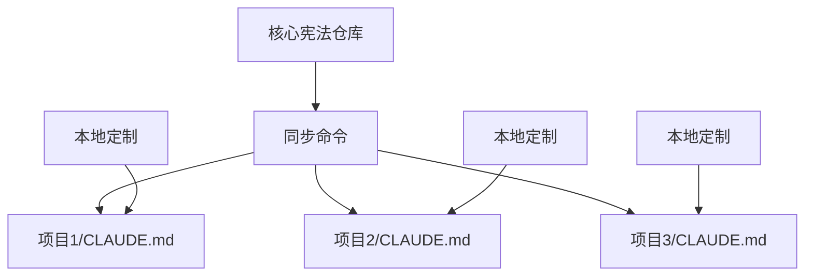

# Claude 宪法同步机制设计

本指南详细说明如何建立一个高效的宪法同步机制，让您只需维护一份核心宪法，就能同步到所有项目。

## 🎯 核心理念



- **单一数据源**: 维护一份 CLAUDE_CONSTITUTION.md
- **智能合并**: 保留各项目的定制内容（E部分）
- **版本控制**: 追踪更新历史
- **自动化**: 通过命令一键同步

## 📋 实施方案

### 方案1：Git 子模块方案

```bash
# 1. 创建宪法仓库
mkdir claude-constitution
cd claude-constitution
git init
cp CLAUDE_CONSTITUTION.md .
git add .
git commit -m "Initial constitution"

# 2. 在项目中添加为子模块
cd /your-project
git submodule add https://github.com/your/claude-constitution .claude-constitution

# 3. 创建同步脚本
cat > sync-claude.sh << 'EOF'
#!/bin/bash
# 更新子模块
git submodule update --remote

# 合并到 CLAUDE.md
python merge-constitution.py
EOF
```

### 方案2：命令驱动方案（推荐）

```markdown
# ~/.claude/commands/sync-constitution.md
请执行宪法同步：

1. 检查更新源
   - 优先级1: $CLAUDE_CONSTITUTION_PATH
   - 优先级2: ~/.claude/constitution/CLAUDE_CONSTITUTION.md
   - 优先级3: 从 GitHub 下载最新版

2. 智能合并策略
   - 提取当前 CLAUDE.md 的 E 部分
   - 使用新版本的 A-D, F-H 部分
   - 保留原有的 E 部分内容
   - 合并任何新增的部分

3. 版本标记
   在文件头部添加：
   <!-- Constitution Version: 1.0.1 -->
   <!-- Last Synced: 2024-01-15 -->
   <!-- Local Modifications: E section -->
```

### 方案3：中央配置服务

```yaml
# claude-config.yaml
constitution:
  source: "https://raw.githubusercontent.com/org/claude/main/CLAUDE_CONSTITUTION.md"
  version: "1.0.1"
  
projects:
  - path: "~/project1"
    customizations: ["E", "H.3"]
  - path: "~/project2"  
    customizations: ["E"]
    
sync:
  auto_backup: true
  merge_strategy: "smart"
  conflict_resolution: "prompt"
```

## 🔧 智能合并算法

### 1. 内容识别
```python
def extract_sections(content):
    """提取 CLAUDE.md 中的各个部分"""
    sections = {}
    current_section = None
    
    for line in content.split('\n'):
        if line.startswith('## '):
            # 识别部分标题
            section_match = re.match(r'## ([A-H])\. (.+)', line)
            if section_match:
                current_section = section_match.group(1)
                sections[current_section] = []
        
        if current_section:
            sections[current_section].append(line)
    
    return sections
```

### 2. 合并策略
```yaml
合并规则:
  A-D部分: 总是使用最新版本
  E部分: 总是保留本地版本
  F-G部分: 使用最新版本
  H部分: 智能合并（如果有本地修改则提示）
  新增部分: 自动添加到末尾
```

### 3. 冲突处理
```markdown
检测到以下冲突：

1. H 部分有本地修改
   - 本地版本：[显示差异]
   - 新版本：[显示差异]
   
   选择：
   a) 保留本地版本
   b) 使用新版本
   c) 手动合并
```

## 📦 完整工作流

### 1. 初始设置
```bash
# 设置宪法源
export CLAUDE_CONSTITUTION_REPO="https://github.com/your/claude-constitution"

# 安装同步命令
curl -o ~/.claude/commands/sync-constitution.md \
  https://raw.githubusercontent.com/your/claude-constitution/main/sync-command.md
```

### 2. 日常使用
```bash
# 在任何项目中
/sync-constitution

# 批量更新
/sync-all-projects

# 检查版本
/check-constitution-version
```

### 3. 团队协作
```bash
# 团队 leader 更新宪法
cd claude-constitution
vim CLAUDE_CONSTITUTION.md
git commit -m "feat: add new workflow pattern"
git push

# 团队成员同步
/sync-constitution
```

## 🎨 高级特性

### 1. 条件同步
```yaml
# .claude-sync.yaml
sync_rules:
  - if: "project_type == 'frontend'"
    include: ["frontend_commands"]
  - if: "team == 'backend'"
    include: ["backend_patterns"]
```

### 2. 模板变量
```markdown
<!-- 在 CLAUDE_CONSTITUTION.md 中 -->
## E. 项目规范定制区

项目名称: {{PROJECT_NAME}}
技术栈: {{TECH_STACK}}
团队规模: {{TEAM_SIZE}}
```

### 3. 钩子脚本
```bash
# .claude/hooks/pre-sync.sh
#!/bin/bash
echo "准备同步宪法..."
git stash push -m "Pre-constitution sync"

# .claude/hooks/post-sync.sh
#!/bin/bash
echo "同步完成，运行测试..."
npm test
```

## 💡 最佳实践

### 1. 版本策略
- 使用语义化版本号
- 主版本：破坏性更改
- 次版本：新增功能
- 补丁版本：修复和优化

### 2. 更新通知
```bash
# 检查更新命令
/check-constitution-updates

# 输出
"发现新版本 1.0.2：
- 新增：遗留项目工作流
- 优化：命令系统说明
- 修复：typo

是否立即更新？[Y/n]"
```

### 3. 回滚机制
```bash
# 保留历史版本
.claude/
├── CLAUDE.md
├── CLAUDE.md.backup
├── CLAUDE.md.v1.0.0
└── CLAUDE.md.v1.0.1
```

## 🚀 一键部署脚本

```bash
#!/bin/bash
# setup-claude-sync.sh

# 1. 创建必要目录
mkdir -p ~/.claude/commands
mkdir -p ~/.claude/constitution

# 2. 下载最新宪法
curl -o ~/.claude/constitution/CLAUDE_CONSTITUTION.md \
  https://raw.githubusercontent.com/your/claude-constitution/main/CLAUDE_CONSTITUTION.md

# 3. 安装同步命令
curl -o ~/.claude/commands/sync-constitution.md \
  https://raw.githubusercontent.com/your/claude-constitution/main/commands/sync.md

# 4. 设置环境变量
echo 'export CLAUDE_CONSTITUTION_PATH="~/.claude/constitution"' >> ~/.bashrc

echo "Claude 宪法同步系统安装完成！"
```

## ❓ 常见问题

**Q: 如何处理大版本更新？**
A: 使用 `/migrate-constitution` 命令进行向导式迁移。

**Q: 可以部分同步吗？**
A: 可以，使用 `/sync-constitution --sections A,B,C` 指定部分。

**Q: 如何贡献宪法更新？**
A: 向宪法仓库提交 PR，经过 review 后合并。

---

*通过这个同步机制，您可以轻松维护数十个项目的 Claude 协作规范，确保所有项目都能享受到最新的最佳实践。*